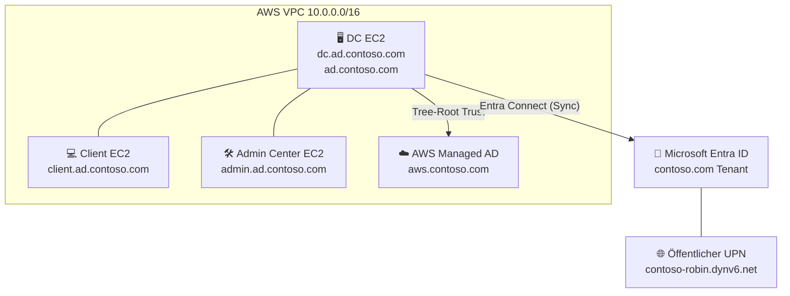

# 📁 Auftrag 01: Planung

<!--
Farblogik (Phase): offen=lightgrey · in-arbeit=orange · review=blueviolet · fertig=brightgreen
-->

**[Ziel](#-ziel) · [Checkliste](#-checkliste) · [Namensschema](#2-namensschema-festlegen) · [Architektur](#️-architektur) · [Begriffe](#-begriffsklärungen) · [Nachweise](#️-nachweise)**

---

## 🎯 Ziel

> Detaillierte Projektplanung der AD/Cloud-Umgebung erstellen inkl. Definition aller relevanten Parameter und Nachweis der Cloud-Bereitschaft.

 

## ✅ Checkliste

- [x] Repo-Grundstruktur angelegt
- [x] Domain-Namensschema festgelegt (Contoso)
- [ ] Setup-Sheet vollständig ausgefüllt (Platzhalter wie Klasse, Repo-Link, EIPs folgen in Auftrag 02)
- [x] Azure for Students aktiviert (Screenshot)
- [x] Entra-ID-Tenant geprüft (Screenshot, Ergebnis: kein Admin-Zugriff im TBZ-Tenant, dokumentiert)
- [x] Architektur-Skizze erstellt (siehe unten)
- [x] `ki-log.md` angelegt

 

## 🧭 Vorgehen

<strong>1. Repo & Struktur</strong>

Repo-Grundgerüst mit einheitlichem Schema pro Auftrag (README, ki-log, ggf. Entscheidungsprotokoll, Screenshots) angelegt. Vorlagen (Header, Badges) wiederverwendbar für alle Aufträge. Details zur Wahl siehe [ki-log.md](./ki-log.md).

<strong>2. Namensschema festlegen</strong>

Als Domain-Basis wurde **Contoso** gewählt, nämlich die von Microsoft in praktisch jeder AD-/Azure-/Entra-Dokumentation verwendete fiktive Beispielfirma. Vorteil: sofort erkennbares, branchenübliches Namensschema statt modul-spezifischem Namen. Abwägung siehe [entscheidungsprotokoll.md](./entscheidungsprotokoll.md).

- Second-Level-Domäne (fiktive Firma): `contoso.com`
- On-Prem AD (EC2, Third-Level): `ad.contoso.com` → [Auftrag 03](../03-gesamtstruktur-dc-client/)
- AWS Managed AD (Third-Level): `aws.contoso.com` → [Auftrag 05](../05-aws-managed-ad/)
- Öffentlicher UPN (später, via dynv6.com): `contoso-robin.dynv6.net` → [Auftrag 13](../13-sso-python-app/)

<strong>3. Cloud-Bereitschaft prüfen</strong>

Azure for Students ist erfolgreich aktiviert. Der Entra-ID-Tenant lässt sich mit dem TBZ-Schul-Account nicht als Admin einsehen (kein Zugriff, dokumentiert), dafür wird in Auftrag 10 ein eigener Tenant benötigt. Details siehe [cloud-readiness.md](./cloud-readiness.md). Wichtig laut Modulvorgabe: **jetzt prüfen, nicht erst später**, da ein Scheitern des Tenants Zeit kostet, die sich später nicht mehr aufholen lässt, genau das haben wir hier frühzeitig erkannt.

 

## 🖥️ Architektur

Erster Entwurf der Zielumgebung. Details (genaue CIDRs/IPs) folgen in [Auftrag 02](../02-initial-setup/) und stehen im [Setup-Sheet](./setup-sheet.md).

| Feld | Wert | Details |
|---|---|---|
| On-Prem AD Domäne | `ad.contoso.com` | [Auftrag 03](../03-gesamtstruktur-dc-client/) |
| AWS Managed AD Domäne | `aws.contoso.com` | [Auftrag 05](../05-aws-managed-ad/) |
| Trust-Typ | Tree-Root Trust | [Setup-Sheet](./setup-sheet.md#6-active-directory-umgebung) |
| Entra ID Sync | Entra Connect | [Auftrag 10](../10-entra-connect/) |
| Öffentlicher UPN (geplant) | `contoso-robin.dynv6.net` | [Auftrag 13](../13-sso-python-app/) |

 

## 📖 Begriffsklärungen

Kurze, selbst recherchierte Erklärungen zu Begriffen aus dem Modul.

<strong>VPC (Virtual Private Cloud)</strong>

Eine VPC ist kein physisches Gerät, sondern ein isolierter, privater Netzwerkabschnitt in der Cloud (z. B. bei AWS oder Google Cloud), in dem eigene virtuelle Maschinen (Instanzen) laufen. Sie verhalten sich wie normale Server, sind aber durch Firewalls und private IP-Adressen vom öffentlichen Internet abgeschottet. Selbst recherchiert am 19.08.2026.

 

## 🖼️ Nachweise

<strong>Screenshots anzeigen</strong>

 

| Screenshot | Beschreibung |
|---|---|
| [01-azure-for-students.png](./00-screenshots/01-azure-for-students.png) | Azure for Students: erfolgreich aktiviert |
| [02-entra-id-tenant.png](./00-screenshots/02-entra-id-tenant.png) | Entra-ID-Tenant: kein Admin-Zugriff im TBZ-Tenant (dokumentierter Fehlschlag) |

Details und Vorgehen bei Fehlschlag: [cloud-readiness.md](./cloud-readiness.md)

 

## 🔗 Verweise

| Datei | Inhalt |
|---|---|
| [setup-sheet.md](./setup-sheet.md) | Vollständige Ressourcen-, Netzwerk- und Zugangsdaten-Übersicht |
| [cloud-readiness.md](./cloud-readiness.md) | Cloud-Bereitschaft-Check (Azure/Entra) |
| [entscheidungsprotokoll.md](./entscheidungsprotokoll.md) | Begründung Domain-Namensschema |
| [ki-log.md](./ki-log.md) | KI-Nutzung in diesem Auftrag |
| [Auftragsstellung (Modul-Repo)](https://ch-tbz-it.gitlab.io/Stud/m159/03-auftraege/01-planung/) | Offizielle Aufgabenstellung |

 

🏠 [Übersicht](../README.md) · ➡️ [Weiter zu Auftrag 02](../02-initial-setup/)

