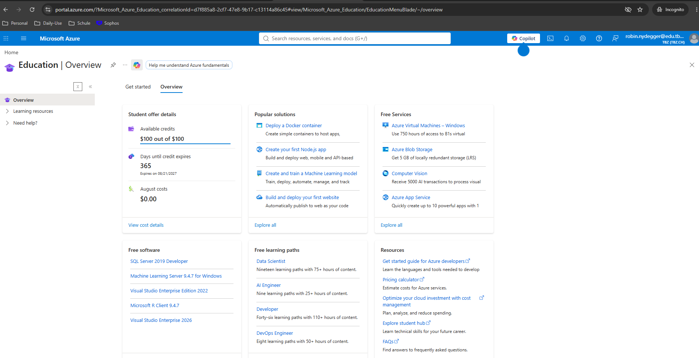
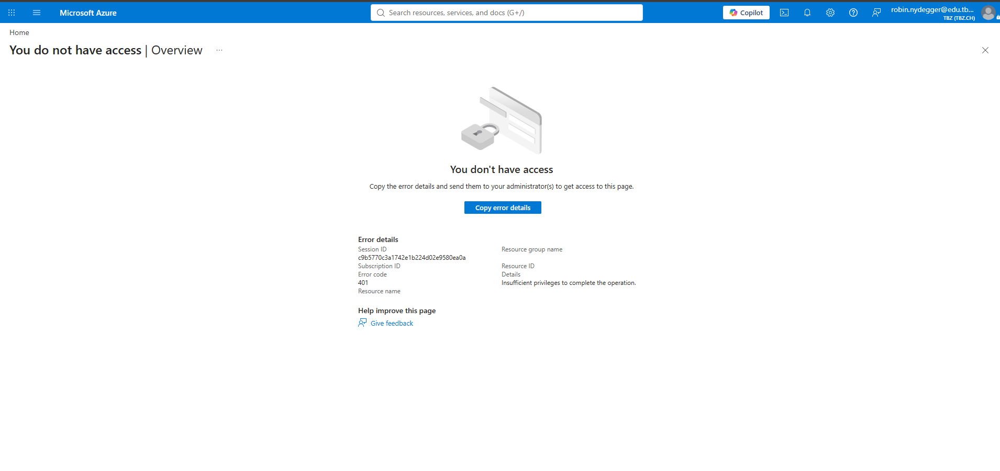

# Cloud-Bereitschaft: Nachweis

---

Laut Modulvorgabe muss der Cloud-Zugang **bereits in Auftrag 01** geprüft werden, nicht erst später, da ein nicht funktionierender Tenant sonst Zeit kostet, die sich nicht mehr aufholen lässt.

| Schritt | Nachweis | Status |
|---|---|---|
| Azure for Students aktivieren | Screenshot der Bestätigung | ✅ erfolgreich |
| Entra-ID-Tenant aufrufen | Screenshot der Fehlermeldung | ⚠️ kein Zugriff (siehe unten) |

## Ergebnis

**Azure for Students**: erfolgreich aktiviert mit dem TBZ-Schul-Account (`robin.nydegger@edu.tbz.ch`). $100 von $100 Guthaben verfügbar, gültig 365 Tage (Ablauf 21.08.2027).

**Entra-ID-Tenant**: der TBZ-Schul-Account läuft im organisationsverwalteten Tenant `TBZ.CH`. Der Aufruf von Microsoft Entra ID im Azure-Portal ergibt "You don't have access" (Fehlercode 401, "Insufficient privileges to complete the operation"), da Schüler-Accounts dort keine Admin-Rechte auf die Tenant-Übersicht haben.

## Bei Fehlschlag

Der Entra-ID-Zugriff ist wie oben dokumentiert fehlgeschlagen (kein Admin-Zugriff im TBZ-Tenant). Vorgehen:

1. Screenshot der Fehlermeldung ist oben abgelegt.
2. Für Auftrag 10 (Entra Connect) wird ein eigener, separater Entra-ID-Tenant benötigt, da im TBZ-Tenant keine Admin-Rechte bestehen. Das wird zu Beginn von Auftrag 10 konkret geklärt.
3. Azure for Students selbst ist unabhängig davon erfolgreich aktiviert und für die AWS-fremden Teile (falls benötigt) nutzbar.

 

⬅️ [Zurück zu Auftrag 01](./README.md)

