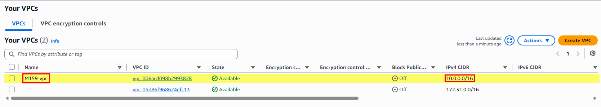
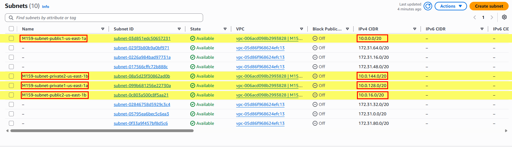
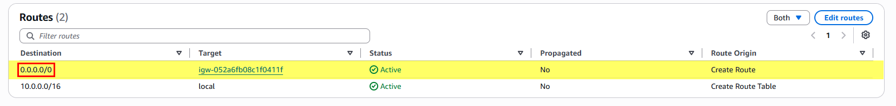
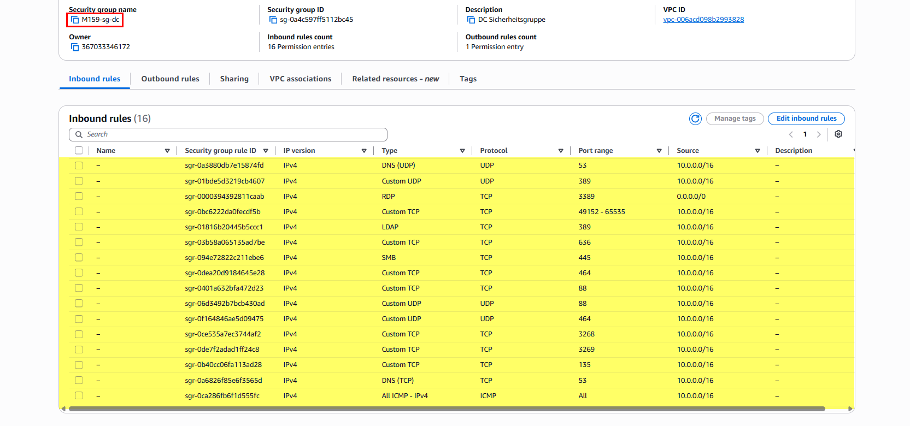
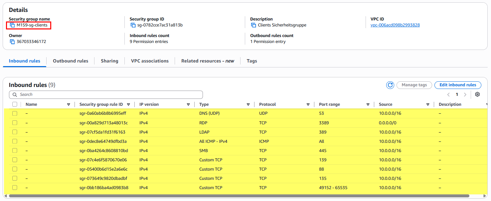
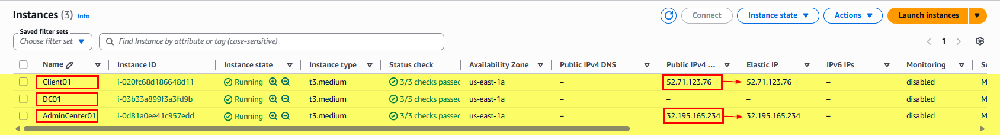
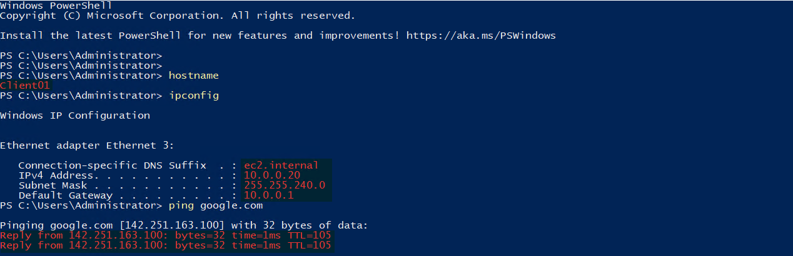

# Auftrag 02: Initial Setup

<!--
Farblogik (Phase): offen=lightgrey · in-arbeit=d29922 (amber) · fertig=1b7f79 (teal) · Kompetenzfelder=58a6ff (blau, neutral)
-->

**[Ziel](#ziel) · [Netzwerk](#schritt-1-bis-5-netzwerkgrundlage) · [Nachweise](#nachweise) · [Checkliste](#checkliste)**

---

<h2 id="ziel">Ziel</h2>

> AWS-Netzwerkgrundlage aufbauen (VPC, Subnetze, Security Groups) und die drei EC2-Instanzen gemäss [Setup-Sheet](../01-planung/setup-sheet.md) erstellen.

 

> Werte stammen aus dem bereits ausgefüllten [Setup-Sheet](../01-planung/setup-sheet.md). Genaue Klickpfade in der AWS-Konsole können sich ändern, im Zweifel an der Oberfläche orientieren statt stur dieser Anleitung folgen.

<h2 id="schritt-1-bis-5-netzwerkgrundlage">Schritt 1 bis 5: Netzwerkgrundlage</h2>

<strong>Schritt 1: AWS-Zugriff prüfen</strong>

- In der AWS-Konsole einloggen (Education-/Studenten-Account).
- Region auswählen und für den Rest des Projekts konsequent dabei bleiben (Setup-Sheet nutzt `us-east-1` als Referenz).
- Prüfen, dass ein Budget/Limit vorhanden ist, das für 3 laufende Windows-EC2-Instanzen reicht.

<strong>Schritt 2: VPC erstellen</strong>

- Neues VPC mit CIDR `10.0.0.0/16` erstellen.
- **Internet Gateway erstellen und am VPC anhängen**, sonst sind auch die "öffentlichen" Subnetze von aussen nicht erreichbar (kein RDP möglich). Das "kein Gateway" aus der Modul-Aufgabenstellung ist so zu verstehen, dass vorerst **kein NAT Gateway** nötig ist (das braucht nur das private Subnetz für ausgehenden Internetzugriff, kostet zusätzlich und kann bei Bedarf später ergänzt werden).
- Name z. B. `M159-vpc`, damit es im Setup-Sheet unter VPC-ID nachgetragen werden kann.

*VPC `M159-vpc` mit CIDR `10.0.0.0/16`.*

<strong>Schritt 3: Subnetze erstellen</strong>

Vier Subnetze gemäss Setup-Sheet, je in einer eigenen Availability Zone:

| Name | CIDR | Typ |
|---|---|---|
| `M159-subnet-private1-us-east-1a` | `10.0.128.0/20` | privat |
| `M159-subnet-private2-us-east-1b` | `10.0.144.0/20` | privat |
| `M159-subnet-public1-us-east-1a` | `10.0.0.0/20` | öffentlich |
| `M159-subnet-public2-us-east-1b` | `10.0.16.0/20` | öffentlich |

Für die öffentlichen Subnetze eine eigene Routentabelle mit Route `0.0.0.0/0 -> Internet Gateway` verknüpfen. Die privaten Subnetze bleiben vorerst ohne Route ins Internet.

Instanz-Platzierung gemäss Setup-Sheet Abschnitt 7 (DC bewusst im privaten Subnetz, siehe Hinweis unten):

| Instanz | Subnetz | Grund |
|---|---|---|
| DC (`dc.ad.contoso.com`, geplant `10.0.128.10`, effektiv `10.0.128.11`) | `M159-subnet-private1-us-east-1a` | Kein direkter Internetzugriff auf den Domain Controller, realistischer/sicherer |
| Client (`client.ad.contoso.com`, `10.0.0.20`) | `M159-subnet-public1-us-east-1a` | Dient später u. a. als Zwischenstation (RDP) zum DC |
| Admin Center (`admin.ad.contoso.com`, `10.0.0.30`) | `M159-subnet-public1-us-east-1a` | Muss von aussen erreichbar sein (Auftrag 06) |

*Alle vier Subnetze mit CIDRs und Availability Zones.*

<strong>Schritt 4: Security Groups erstellen</strong>

Zwei Security Groups, Regeln stehen bereits im [Setup-Sheet](../01-planung/setup-sheet.md#05-aws-sicherheitsgruppen):

- **Domain Controller**: RDP, LDAP, LDAPS, Kerberos, SMB, DNS, RPC (inkl. Ephemeral-Port-Bereich 49152 bis 65535), ICMP, Global Catalog, Global Catalog SSL, Kerberos Password Change. Da der DC im privaten Subnetz liegt, kommt RDP darauf ohnehin nur aus dem VPC selbst an (z. B. vom Client aus), die SG-Regel `0.0.0.0/0` schadet trotzdem nicht, weil sie durch das fehlende Routing zum Internet Gateway faktisch nicht von aussen nutzbar ist.
- **Clients**: RDP von aussen, restliche Ports (Kerberos, RPC, NetBIOS, LDAP, DNS, SMB, RPC Ephemeral, ICMP) nur aus dem VPC-Adressbereich.

*Routentabelle `M159-rt-public` mit Route zum Internet Gateway.*

*Security Group `M159-sg-dc` mit Inbound-Regeln.*

*Security Group `M159-sg-clients` mit Inbound-Regeln.*

<strong>Schritt 5: Key Pair erstellen</strong>

- Neues Key Pair erstellen (z. B. `m159-key`), `.pem`-Datei sicher ablegen.
- **Nicht ins Repository committen**, siehe `.gitignore` (`*.pem` ist bereits ausgeschlossen).
- Wird für den ersten Login (Administrator-Passwort entschlüsseln) auf jeder neuen Instanz gebraucht.

 

<h2 id="ec2-instanzen-und-windows-grundkonfiguration">EC2-Instanzen und Windows-Grundkonfiguration</h2>

Drei EC2-Instanzen erstellt und mit Hostname, Ping-Firewallregel, deaktiviertem IPv6 sowie (bei den beiden Desktop-Instanzen) deaktiviertem IE ESC und angepassten Ordneroptionen konfiguriert. RDP-Zugriffskette getestet: Client01/AdminCenter01 direkt über Elastic IP erreichbar, DC01 nur via Sprung über Client01 (kein öffentlicher Zugriff).

*Alle drei EC2-Instanzen inkl. privater IP, Public IP und Elastic IP.*

*RDP-Verbindung zu Client01 mit gesetztem Hostnamen, ipconfig und Ping-Test.*

 

<h2 id="nachweise">Nachweise</h2>

<strong>Screenshots anzeigen</strong>

 

| Screenshot | Beschreibung |
|---|---|
| [01-vpc-uebersicht.png](./00-screenshots/01-vpc-uebersicht.png) | VPC `M159-vpc` mit CIDR `10.0.0.0/16` |
| [02-subnetze.png](./00-screenshots/02-subnetze.png) | Alle vier Subnetze mit CIDRs und Availability Zones |
| [03-routing-tabelle.png](./00-screenshots/03-routing-tabelle.png) | Routentabelle `M159-rt-public` mit Route zum Internet Gateway |
| [04-security-group-dc.png](./00-screenshots/04-security-group-dc.png) | Security Group `M159-sg-dc` mit Inbound-Regeln |
| [05-security-group-clients.png](./00-screenshots/05-security-group-clients.png) | Security Group `M159-sg-clients` mit Inbound-Regeln |
| [06-ec2-instanzen-und-ips.png](./00-screenshots/06-ec2-instanzen-und-ips.png) | Alle drei EC2-Instanzen inkl. privater IP, Public IP und Elastic IP |
| [07-rdp-client01.png](./00-screenshots/07-rdp-client01.png) | RDP-Verbindung zu Client01 mit gesetztem Hostnamen, ipconfig und Ping-Test |

 

<h2 id="checkliste">Checkliste</h2>

- [x] AWS-Zugriff geprüft
- [x] VPC erstellt (`10.0.0.0/16`) inkl. Internet Gateway
- [x] 4 Subnetze erstellt, Routentabellen gesetzt
- [x] 2 Security Groups erstellt
- [x] Key Pair erstellt
- [x] DC erstellt (Core, privates Subnetz, IP `10.0.128.11` statt `10.0.128.10`, siehe Setup-Sheet)
- [x] Client erstellt (Desktop, öffentliches Subnetz)
- [x] Admin Center erstellt (Desktop, öffentliches Subnetz)
- [x] Windows-Grundkonfiguration auf allen drei Instanzen
- [x] Screenshots/Nachweise abgelegt
- [x] `ki-log.md` ausgefüllt
- [x] Setup-Sheet mit effektiven VPC-ID/Elastic IPs nachgeführt

 

<h2 id="verweise">Verweise</h2>

| Datei | Inhalt |
|---|---|
| [setup-sheet.md](../01-planung/setup-sheet.md) | Alle geplanten CIDRs, Security-Group-Regeln, Instanz-Daten |
| [ki-log.md](./ki-log.md) | KI-Nutzung in diesem Auftrag |
| [Auftragsstellung (Modul-Repo)](https://ch-tbz-it.gitlab.io/Stud/m159/03-auftraege/02-initial-setup/) | Offizielle Aufgabenstellung |
| [Fragenkatalog (Modul-Repo)](https://ch-tbz-it.gitlab.io/Stud/m159/03-auftraege/02-initial-setup/fragen.html) | Vorbereitung mündlicher Nachweis |

 

⬅️ [Auftrag 01: Planung](../01-planung/README.md) · 🏠 [Übersicht](../README.md) · ➡️ [Auftrag 03: Gesamtstruktur (1. DC) & Client](../03-gesamtstruktur-dc-client/README.md)

