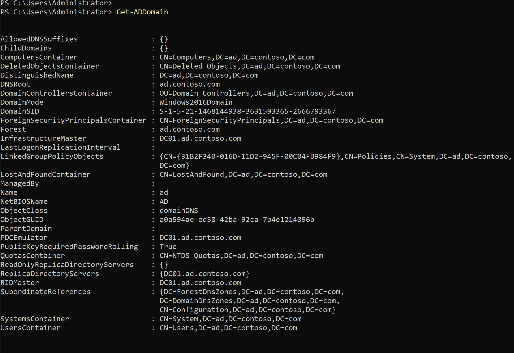
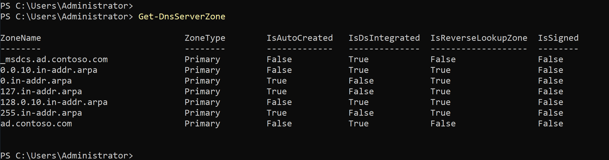
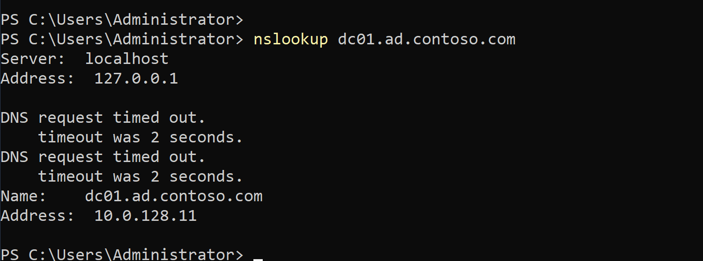
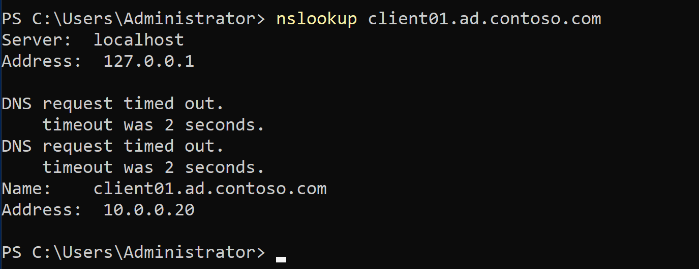
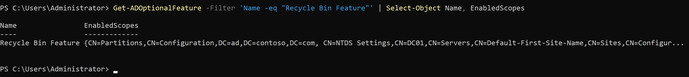
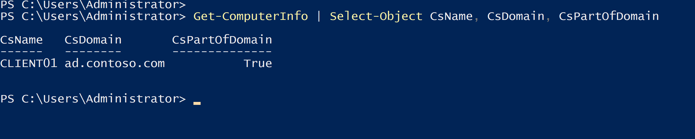
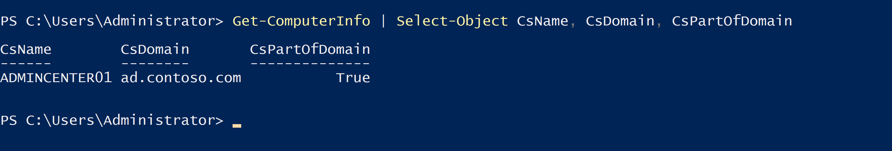
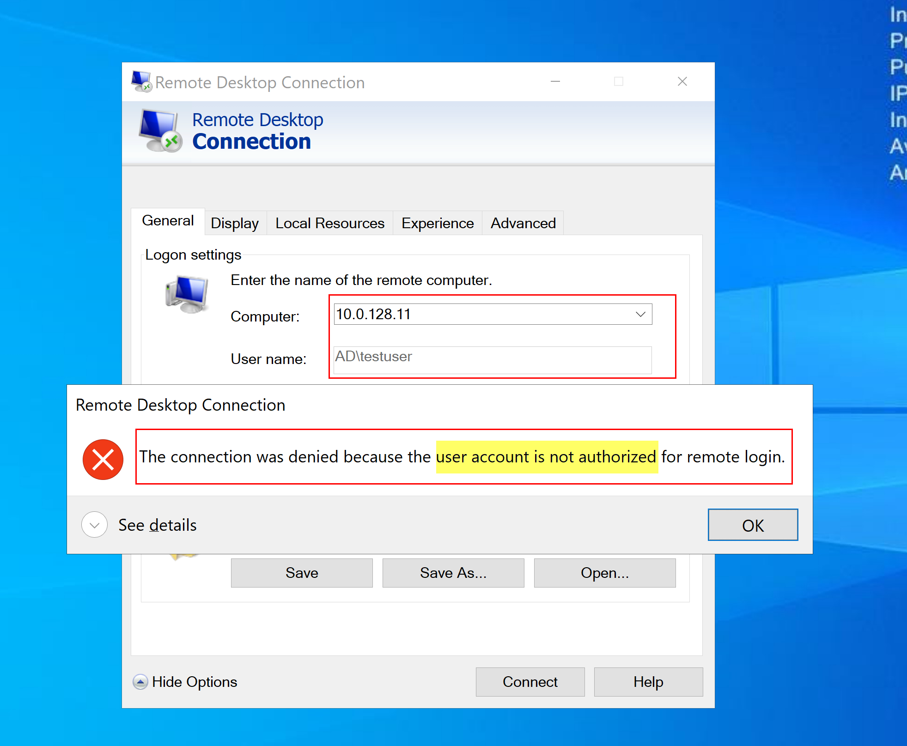
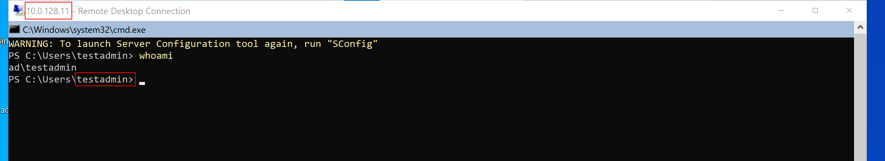

<div align="right">


</div>

<div align="center">

# Auftrag 03: Gesamtstruktur (1. DC) & Client

<!--
Farblogik (Phase): offen=lightgrey · in-arbeit=d29922 (amber) · fertig=1b7f79 (teal)
-->


**[Ziel](#ziel) · [Vorgehen](#vorgehen) · [Nachweise](#nachweise) · [Checkliste](#checkliste)**

</div>

---

<h2 id="ziel"><font color="#8250df">Ziel</font></h2>

> Erste Domäne (`ad.contoso.com`) auf DC01 erstellen, DNS vollständig konfigurieren (Forward-, Reverse-Zonen, PTR-Records), AD Recycle Bin aktivieren, beide Clients (Client01, AdminCenter01) der Domäne beitreten lassen und ein RDP-Berechtigungskonzept über AD-Gruppen umsetzen und testen.

<br>

<h2 id="vorgehen"><font color="#8250df">Vorgehen</font></h2>

<details open>
<summary><strong>1. AD DS-Rolle und Domänen-Beförderung</strong></summary>

Auf DC01 die Rolle installiert und den Forest erstellt:

```powershell
Install-WindowsFeature -Name AD-Domain-Services -IncludeManagementTools

Install-ADDSForest -DomainName "ad.contoso.com" -DomainNetbiosName "AD" -InstallDns:$true -SafeModeAdministratorPassword (ConvertTo-SecureString "..." -AsPlainText -Force) -Force:$true
```

Das DSRM-Passwort (Safe Mode Administrator Password) wird nur im Notfall (AD-Wiederherstellung) benötigt und ist sicher im Passwort-Manager abgelegt, nicht im Repo. Der Erfolg der Beförderung wurde über `Get-ADDomain` bestätigt (liefert die Domain-Infos ohne Fehler).



*`Get-ADDomain`-Ausgabe nach erfolgreicher Beförderung, keine Fehler.*

</details>

<details open>
<summary><strong>2. DNS-Konfiguration</strong></summary>

Auf DC01:

- Forwarder auf `9.9.9.9` gesetzt, damit externe Namen aufgelöst werden können:

  ```powershell
  Set-DnsServerForwarder -IPAddress 9.9.9.9
  ```

- Reverse-Lookupzonen für beide relevanten Subnetze erstellt (`Add-DnsServerPrimaryZone -NetworkID ... -ReplicationScope "Forest"`): `10.0.128.0/20` (DC01, private Subnetze) und `10.0.0.0/20` (Client01/AdminCenter01, öffentliches Subnetz).
- PTR-Records für DC01 und Client01 manuell eingetragen (`Add-DnsServerResourceRecordPtr`).
- Der A-Record für Client01 wurde nicht automatisch erstellt, sondern musste über `ipconfig /registerdns` auf Client01 aktiv angestossen werden.
- Vorwärts- und Rückwärtsauflösung für beide Server mit `nslookup` erfolgreich getestet.



*Beide Reverse-Lookupzonen (`10.0.128.0/20`, `10.0.0.0/20`) angelegt.*



*Vorwärts- und Rückwärtsauflösung für DC01 erfolgreich.*



*Vorwärts- und Rückwärtsauflösung für Client01 erfolgreich.*

</details>

<details open>
<summary><strong>3. AD Recycle Bin</strong></summary>

Aktiviert (unumkehrbar, deshalb bewusst früh gemacht):

```powershell
Enable-ADOptionalFeature -Identity 'Recycle Bin Feature' -Scope ForestOrConfigurationSet -Target 'ad.contoso.com'
```

Über `Get-ADOptionalFeature` mit gefülltem `EnabledScopes` bestätigt.



*`Get-ADOptionalFeature` zeigt gefüllte `EnabledScopes`.*

</details>

<details open>
<summary><strong>4. Client-Integration</strong></summary>

Auf beiden Clients (Client01, AdminCenter01) gleiches Vorgehen:

- DNS-Server der Netzwerkkarte auf DC01 (`10.0.128.11`) umgestellt.
- Domänenbeitritt durchgeführt, angemeldet als `AD\Administrator` (nicht der lokale Administrator):

  ```powershell
  Set-DnsClientServerAddress -InterfaceAlias "Ethernet 3" -ServerAddresses "10.0.128.11"

  Add-Computer -DomainName "ad.contoso.com" -Credential (Get-Credential) -Restart
  ```

- Nach Neustart Beitritt über `Get-ComputerInfo` verifiziert (`CsPartOfDomain = True`, `CsDomain = ad.contoso.com`).



*Client01: `Get-ComputerInfo` bestätigt Domänenbeitritt.*



*AdminCenter01: `Get-ComputerInfo` bestätigt Domänenbeitritt.*

</details>

<details open>
<summary><strong>5. RDP-Konzept (zwei AD-Gruppen, ohne GPO)</strong></summary>

Umgesetztes Modell (Begründung siehe [entscheidungsprotokoll.md](./entscheidungsprotokoll.md)): eine Gruppe `RDP-Admins` mit Zugriff auf alle drei Server, eine Gruppe `RDP-Users` nur mit Zugriff auf die Client-Rechner, nicht auf DC01.

- Zwei globale Sicherheitsgruppen erstellt: `New-ADGroup -Name "RDP-Admins" ...` und `New-ADGroup -Name "RDP-Users" ...`.
- Zwei Testbenutzer erstellt (`testadmin`, `testuser`) und den jeweiligen Gruppen zugewiesen (`Add-ADGroupMember`).
- Auf DC01 (Domain Controller, keine lokale "Remote Desktop Users"-Gruppe vorhanden): `RDP-Admins` in die domänenweite Gruppe `Remote Desktop Users` aufgenommen.
- Auf Client01 und AdminCenter01 (normale Member-Server): beide Gruppen in die lokale Gruppe `Remote Desktop Users` aufgenommen (analog für `RDP-Users`).

  ```powershell
  Add-ADGroupMember -Identity "Remote Desktop Users" -Members "RDP-Admins"

  Add-LocalGroupMember -Group "Remote Desktop Users" -Member "AD\RDP-Admins"
  ```

- Wichtiger Fund beim Testen: Der erste RDP-Versuch mit `testadmin` auf DC01 wurde trotz korrekter Gruppenmitgliedschaft abgelehnt. Ursache war die tatsächliche lokale Sicherheitsrichtlinie "Allow log on through Remote Desktop Services" (`SeRemoteInteractiveLogonRight`), die auf DC01 nur die SID von `Administrators` (`S-1-5-32-544`) enthielt, nicht `Remote Desktop Users` (`S-1-5-32-555`). Über `secedit` geprüft, `Remote Desktop Users` ergänzt und mit `secedit /configure` sowie `gpupdate /force` angewendet, danach funktionierte der Login wie geplant.
- Konzept per RDP-Login getestet: `testuser` auf DC01 korrekt abgelehnt ("not authorized for remote login"), `testadmin` auf DC01 nach der Richtlinien-Korrektur erfolgreich verbunden, Identität zusätzlich mit `whoami` (`ad\testadmin`) im Terminal bestätigt.



*`testuser` auf DC01 korrekt mit "not authorized for remote login" abgelehnt.*



*`testadmin` auf DC01 erfolgreich verbunden, `whoami` bestätigt `ad\testadmin`.*

</details>

<br>

<h2 id="nachweise"><font color="#8250df">Nachweise</font></h2>

<details open>
<summary><strong>Screenshots anzeigen</strong></summary>

<br>

| Screenshot | Beschreibung |
|---|---|
| [01-get-addomain.png](./00-screenshots/01-get-addomain.png) | `Get-ADDomain` bestätigt erfolgreiche Forest-/Domänen-Erstellung |
| [02-dns-reverse-zonen.png](./00-screenshots/02-dns-reverse-zonen.png) | `Get-DnsServerZone` mit beiden Reverse-Lookupzonen |
| [03-nslookup-dc01.png](./00-screenshots/03-nslookup-dc01.png) | Vorwärts-/Rückwärtsauflösung DC01 erfolgreich |
| [04-nslookup-client01.png](./00-screenshots/04-nslookup-client01.png) | Vorwärts-/Rückwärtsauflösung Client01 erfolgreich |
| [05-recycle-bin.png](./00-screenshots/05-recycle-bin.png) | `Get-ADOptionalFeature` zeigt aktivierte AD Recycle Bin |
| [06a-domain-beitritt-client01.png](./00-screenshots/06a-domain-beitritt-client01.png) | `Get-ComputerInfo` auf Client01, `CsPartOfDomain = True` |
| [06b-domain-beitritt-admincenter01.png](./00-screenshots/06b-domain-beitritt-admincenter01.png) | `Get-ComputerInfo` auf AdminCenter01, `CsPartOfDomain = True` |
| [07-rdp-testuser-verweigert.png](./00-screenshots/07-rdp-testuser-verweigert.png) | `testuser` auf DC01 korrekt abgelehnt |
| [08-rdp-testadmin-erfolgreich.png](./00-screenshots/08-rdp-testadmin-erfolgreich.png) | `testadmin` auf DC01 erfolgreich angemeldet, `whoami` zeigt `ad\testadmin` |

</details>

<br>

<h2 id="checkliste"><font color="#8250df">Checkliste</font></h2>

- [x] AD DS-Rolle installiert
- [x] DC01 zu Domain Controller befördert (`ad.contoso.com`)
- [x] DNS-Forwarder konfiguriert (`9.9.9.9`)
- [x] Reverse-Lookupzonen erstellt (beide Subnetze)
- [x] PTR-Records eingetragen und getestet
- [x] AD Recycle Bin aktiviert
- [x] Client01 der Domäne beigetreten
- [x] AdminCenter01 der Domäne beigetreten
- [x] Zwei AD-Gruppen erstellt (`RDP-Admins`, `RDP-Users`)
- [x] RDP-Berechtigung ohne GPO umgesetzt (DC01 über AD-Gruppe, Clients über lokale Gruppe)
- [x] RDP-Konzept mit Testbenutzern verifiziert (Zugriff erlaubt/verweigert wie geplant)
- [x] Screenshots/Nachweise abgelegt
- [x] `ki-log.md` ausgefüllt
- [x] `entscheidungsprotokoll.md` ausgefüllt (RDP-Konzept)

<br>

<h2 id="verweise"><font color="#8250df">Verweise</font></h2>

| Datei | Inhalt |
|---|---|
| [entscheidungsprotokoll.md](./entscheidungsprotokoll.md) | Begründung RDP-Konzept |
| [ki-log.md](./ki-log.md) | KI-Nutzung in diesem Auftrag |
| [setup-sheet.md](../01-planung/setup-sheet.md) | Netzwerk-/Instanzdaten (DC01-IP etc.) |
| [Auftragsstellung (Modul-Repo)](https://ch-tbz-it.gitlab.io/Stud/m159/03-auftraege/03-neue-gesamtstruktur-und-client/) | Offizielle Aufgabenstellung |
| [Fragenkatalog (Modul-Repo)](https://ch-tbz-it.gitlab.io/Stud/m159/03-auftraege/03-neue-gesamtstruktur-und-client/fragen.html) | Vorbereitung mündlicher Nachweis |

<br>

<div align="center">

⬅️ [Auftrag 02: Initial Setup](../02-initial-setup/README.md) · 🏠 [Übersicht](../README.md) · ➡️ [Auftrag 04: Freigaben, Laufwerke, Berechtigungen](../04-freigaben-berechtigungen/README.md)

</div>
