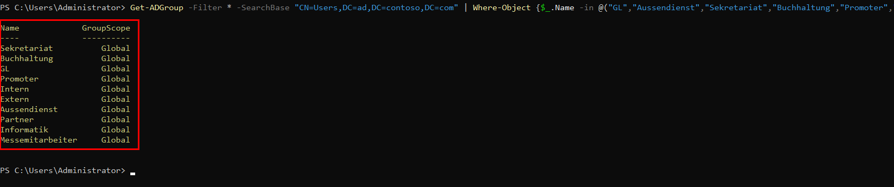
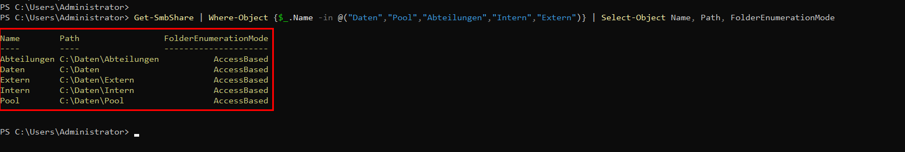
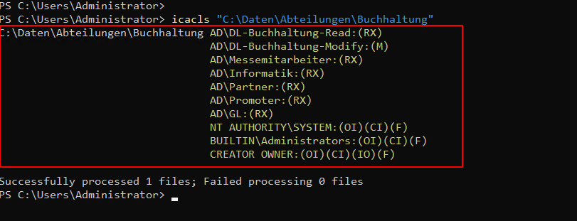
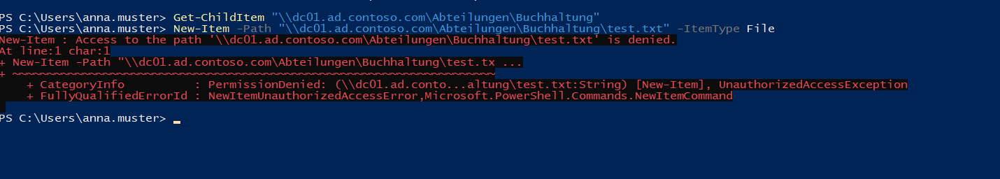
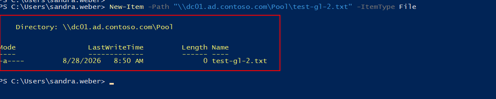
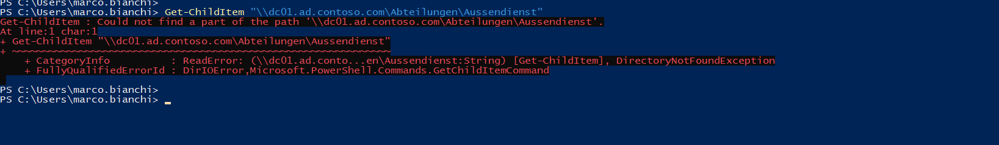

<div align="center">

# 📁 Auftrag 04: Freigaben, Laufwerke, Berechtigungen

<!--
Farblogik (Phase): offen=lightgrey · in-arbeit=orange · review=blueviolet · fertig=brightgreen
-->


**[Ziel](#-ziel) · [Vorgehen](#-vorgehen) · [Nachweise](#️-nachweise) · [Checkliste](#-checkliste)**

</div>

---

## 🎯 Ziel

> Benutzer und Gruppen gemäss Abteilungsstruktur anlegen, eine Ordner-/Freigabestruktur mit korrekten Freigabe- und NTFS-Berechtigungen aufbauen, Access-Based Enumeration aktivieren, die Berechtigungen mit drei konkreten Testszenarien verifizieren und die Struktur für mindestens zwei Abteilungen nach dem AGDLP-Konzept verbessern.

<br>

> Ordner-/Freigabestruktur und Berechtigungsmatrix stammen aus der offiziellen Auftragsseite (Bild-Tabelle, per Screenshot übernommen). Die Matrix umfasst acht Abteilungen (GL, Aussendienst, Sekretariat, Buchhaltung, Promoter, Partner, Informatik, Messemitarbeiter), das ursprüngliche Setup-Sheet sah nur vier vor, deshalb wurden Gruppen/Benutzer für die restlichen vier bewusst ergänzt (Details siehe Schritt 1).

## 🧭 Vorgehen

<details open>
<summary><strong>1. Benutzer und Gruppen</strong></summary>

Acht globale Sicherheitsgruppen erstellt, eine pro Abteilung (`GL`, `Aussendienst`, `Sekretariat`, `Buchhaltung`, `Promoter`, `Partner`, `Informatik`, `Messemitarbeiter`), sowie zwei übergeordnete Gruppen `Intern` und `Extern`. Nur die ersten vier Abteilungen (Sekretariat, Buchhaltung, GL, Promoter) waren im Setup-Sheet vorgesehen, die Erweiterung auf alle acht wurde bewusst entschieden, da die offizielle Berechtigungsmatrix acht Abteilungen zeigt.

Pro Abteilung ein Testbenutzer erstellt und der jeweiligen Gruppe zugewiesen:

| Abteilung | Benutzer | SamAccountName |
|---|---|---|
| Sekretariat | Anna Muster | anna.muster |
| Buchhaltung | Peter Keller | peter.keller |
| GL | Sandra Weber | sandra.weber |
| Promoter | Marco Bianchi | marco.bianchi |
| Aussendienst | Laura Frei | laura.frei |
| Partner | Thomas Steiner | thomas.steiner |
| Informatik | Nina Huber | nina.huber |
| Messemitarbeiter | David Roth | david.roth |

Kategorisierung in Intern/Extern (Aussendienst und Partner sind ausserhalb der Firma tätig, deshalb extern; Informatik und Messemitarbeiter sind interne Rollen, deshalb intern; diese Zuordnung war in der Matrix nicht explizit vorgegeben und wurde bewusst ergänzt):

- **Intern**: Sekretariat, Buchhaltung, GL, Informatik, Messemitarbeiter
- **Extern**: Promoter, Aussendienst, Partner

Anmeldetests mit allen acht Benutzern durchgeführt: Alle Konten funktionieren (Login lässt sich mit korrektem Passwort ausführen), aber noch keiner ist in einer RDP-Berechtigungsgruppe, daher werden alle Verbindungsversuche korrekt mit "not authorized for remote login" abgelehnt.



</details>

<details open>
<summary><strong>2. Ordner- und Freigabestruktur</strong></summary>

Physischer Pfad auf DC01: `C:\Daten\`. Fünf Freigaben veröffentlicht (`Daten`, `Pool`, `Abteilungen`, `Intern`, `Extern`), Freigabeberechtigung jeweils "Jeder: Ändern" (`New-SmbShare ... -ChangeAccess "Everyone"`), die eigentliche Einschränkung erfolgt über NTFS. Acht Unterordner unter `Abteilungen` angelegt (kein eigener Share, nur NTFS-berechtigt), zusätzlich `Profiles` als leerer Platzhalterordner ohne Freigabe.

```powershell
New-Item -Path "C:\Daten" -ItemType Directory
New-Item -Path "C:\Daten\Pool" -ItemType Directory
New-Item -Path "C:\Daten\Abteilungen" -ItemType Directory
New-Item -Path "C:\Daten\Abteilungen\GL" -ItemType Directory
# ... je ein Unterordner pro Abteilung
New-Item -Path "C:\Daten\Profiles" -ItemType Directory
New-Item -Path "C:\Daten\Intern" -ItemType Directory
New-Item -Path "C:\Daten\Extern" -ItemType Directory

New-SmbShare -Name "Daten" -Path "C:\Daten" -ChangeAccess "Everyone"
New-SmbShare -Name "Pool" -Path "C:\Daten\Pool" -ChangeAccess "Everyone"
New-SmbShare -Name "Abteilungen" -Path "C:\Daten\Abteilungen" -ChangeAccess "Everyone"
New-SmbShare -Name "Intern" -Path "C:\Daten\Intern" -ChangeAccess "Everyone"
New-SmbShare -Name "Extern" -Path "C:\Daten\Extern" -ChangeAccess "Everyone"
```

Auf `Daten` und jedem Unterordner die Vererbung deaktiviert und die Standardgruppen (`BUILTIN\Users`, `Authenticated Users`) entfernt, bevor die eigentlichen Rechte gesetzt wurden:

```powershell
icacls "C:\Daten" /inheritance:d
icacls "C:\Daten" /remove:g "BUILTIN\Users"
icacls "C:\Daten" /remove:g "Authenticated Users"
```



</details>

<details open>
<summary><strong>3. NTFS-Berechtigungen und Access-Based Enumeration</strong></summary>

Berechtigungsmatrix vollständig (alle Zeilen, nicht nur die für die volle Punktzahl geforderten grün markierten) über `icacls` umgesetzt, "C" (Change) als NTFS-Recht `(M)` (Modify), "R" (Read) als `(RX)` (Read & Execute) übersetzt:

```powershell
icacls "C:\Daten" /grant "AD\Buchhaltung:(M)"
icacls "C:\Daten" /grant "AD\Informatik:(M)"

icacls "C:\Daten\Pool" /grant "AD\GL:(M)" /grant "AD\Aussendienst:(M)" ...  # alle 8 Abteilungen

icacls "C:\Daten\Abteilungen" /grant "AD\GL:(RX)" ...  # alle 8 Abteilungen

# je Unterordner die eigene Abteilung mit (M), die laut Matrix lesenden Abteilungen mit (RX)
```

Ein Fehler ist dabei passiert und wurde beim Testen entdeckt und korrigiert: Bei `Abteilungen\Buchhaltung` fehlten zunächst die Lesezugriffe für Sekretariat und Aussendienst, das ist nachträglich korrigiert worden (siehe Reflexion in [ki-log.md](./ki-log.md)).

Access-Based Enumeration auf allen fünf Freigaben aktiviert, damit nicht berechtigte Ordner für Benutzer komplett unsichtbar sind, statt nur den Zugriff zu verweigern:

```powershell
Set-SmbShare -Name "Daten" -FolderEnumerationMode AccessBased -Force
Set-SmbShare -Name "Pool" -FolderEnumerationMode AccessBased -Force
Set-SmbShare -Name "Abteilungen" -FolderEnumerationMode AccessBased -Force
Set-SmbShare -Name "Intern" -FolderEnumerationMode AccessBased -Force
Set-SmbShare -Name "Extern" -FolderEnumerationMode AccessBased -Force
```



</details>

<details open>
<summary><strong>4. Berechtigungstests</strong></summary>

Drei geforderte Testszenarien über UNC-Pfad von Client01 aus durchgeführt (dafür mussten die drei betroffenen Testbenutzer zuerst zur lokalen Gruppe "Remote Desktop Users" auf Client01 hinzugefügt werden, sonst wäre schon der RDP-Login gescheitert):

| Test | Befehl | Ergebnis |
|---|---|---|
| Sekretariat liest Buchhaltung | `Get-ChildItem \\dc01.ad.contoso.com\Abteilungen\Buchhaltung` | ✅ Lesen erfolgreich |
| Sekretariat schreibt in Buchhaltung | `New-Item \\dc01.ad.contoso.com\Abteilungen\Buchhaltung\test.txt` | ✅ korrekt verweigert ("Access is denied") |
| GL schreibt in Pool | `New-Item \\dc01.ad.contoso.com\Pool\test-gl.txt` | ✅ erfolgreich |
| Promoter sieht Aussendienst | `Get-ChildItem \\dc01.ad.contoso.com\Abteilungen\Aussendienst` | ✅ korrekt verweigert (ABE blendet Ordner aus, "Could not find a part of the path") |







</details>

<details>
<summary><strong>5. Group Nesting nach AGDLP (noch offen)</strong></summary>

_Noch zu ergänzen: alternative Berechtigungsstruktur mit Rollengruppen nach dem AGDLP-Modell (Account, Global, Domain Local, Permissions), visualisiert dokumentiert, für mindestens zwei Abteilungen umgesetzt._

</details>

<br>

## 🖼️ Nachweise

<details open>
<summary><strong>Screenshots anzeigen</strong></summary>

<br>

| Screenshot | Beschreibung |
|---|---|
| [01-ad-gruppen.png](./00-screenshots/01-ad-gruppen.png) | Alle acht Abteilungsgruppen plus Intern/Extern in AD |
| [02-freigaben-uebersicht.png](./00-screenshots/02-freigaben-uebersicht.png) | `Get-SmbShare`, alle fünf Freigaben mit ABE aktiv |
| [03-ntfs-berechtigungen.png](./00-screenshots/03-ntfs-berechtigungen.png) | `icacls`-Ausgabe der Abteilungsordner |
| [04-test-sekretariat-buchhaltung.png](./00-screenshots/04-test-sekretariat-buchhaltung.png) | Test 1: Sekretariat liest Buchhaltung, Schreiben verweigert |
| [05-test-gl-pool.png](./00-screenshots/05-test-gl-pool.png) | Test 2: GL schreibt erfolgreich in Pool |
| [06-test-promoter-aussendienst.png](./00-screenshots/06-test-promoter-aussendienst.png) | Test 3: Promoter hat keinen Zugriff auf Aussendienst |

</details>

<br>

## ✅ Checkliste

- [x] 8 Abteilungsgruppen erstellt (statt ursprünglich geplanter 4)
- [x] Gruppen `Intern`/`Extern` erstellt und alle Abteilungen zugeordnet
- [x] 8 Testbenutzer erstellt und Gruppen zugewiesen
- [x] Anmeldetests durchgeführt
- [x] Ordnerstruktur unter `C:\Daten` angelegt
- [x] 5 Freigaben erstellt (Freigabeberechtigung "Jeder: Ändern")
- [x] Vererbung deaktiviert, Standardgruppen entfernt
- [x] NTFS-Berechtigungsmatrix vollständig umgesetzt
- [x] Access-Based Enumeration auf allen Freigaben aktiviert
- [x] Test 1: Sekretariat liest Buchhaltung
- [x] Test 2: GL schreibt in Pool
- [x] Test 3: Promoter kein Zugriff auf Aussendienst
- [ ] Group Nesting nach AGDLP für mindestens 2 Abteilungen
- [ ] Screenshots/Nachweise abgelegt
- [ ] `ki-log.md` ausgefüllt

<br>

## 🔗 Verweise

| Datei | Inhalt |
|---|---|
| [ki-log.md](./ki-log.md) | KI-Nutzung in diesem Auftrag |
| [setup-sheet.md](../01-planung/setup-sheet.md) | Abteilungs-/Benutzerplanung |
| [Auftragsstellung (Modul-Repo)](https://ch-tbz-it.gitlab.io/Stud/m159/03-auftraege/04-freigaben-laufwerke-berechtigungen/) | Offizielle Aufgabenstellung |
| [Fragenkatalog (Modul-Repo)](https://ch-tbz-it.gitlab.io/Stud/m159/03-auftraege/04-freigaben-laufwerke-berechtigungen/fragen.html) | Vorbereitung mündlicher Nachweis |

<br>

<div align="center">

⬅️ [Auftrag 03: Gesamtstruktur (1. DC) & Client](../03-gesamtstruktur-dc-client/README.md) · 🏠 [Übersicht](../README.md) · ➡️ [Auftrag 07: DIT & GPOs](../07-dit-gpos/README.md)

</div>
