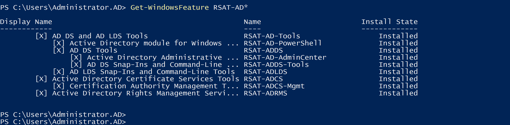
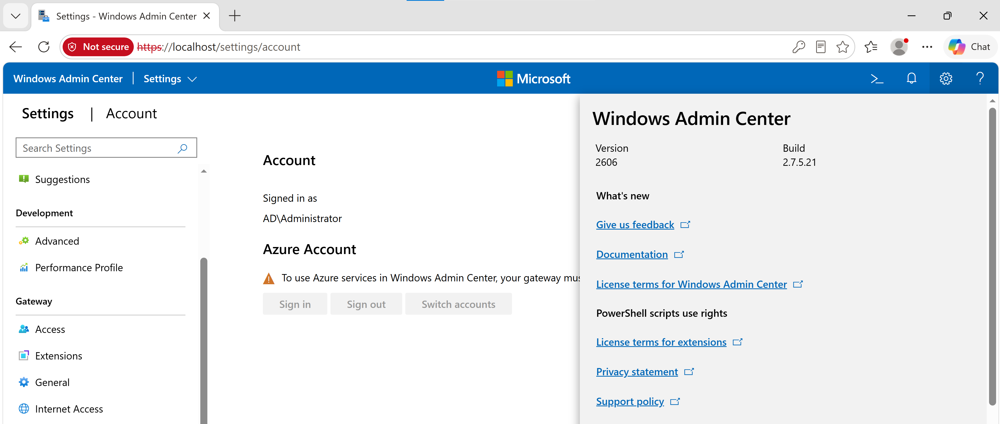
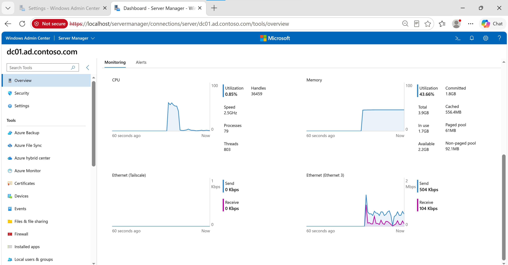
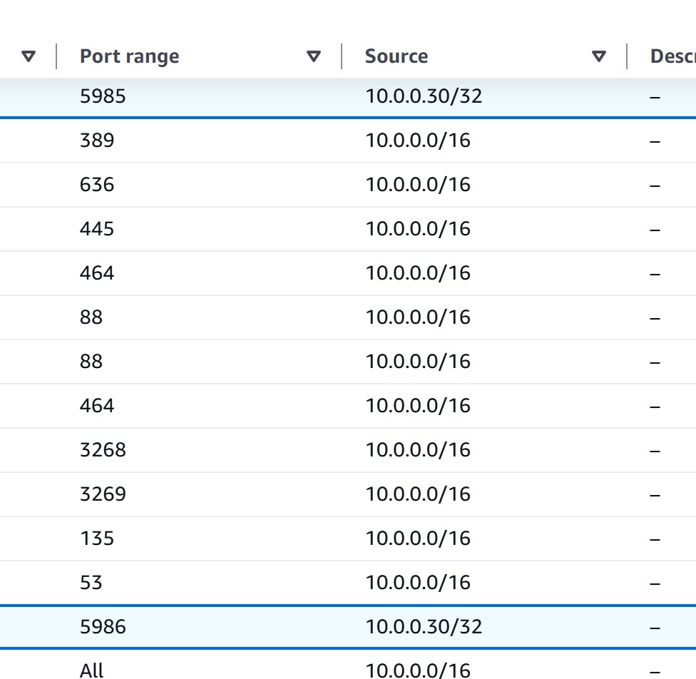
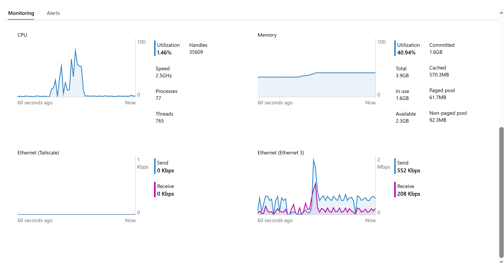
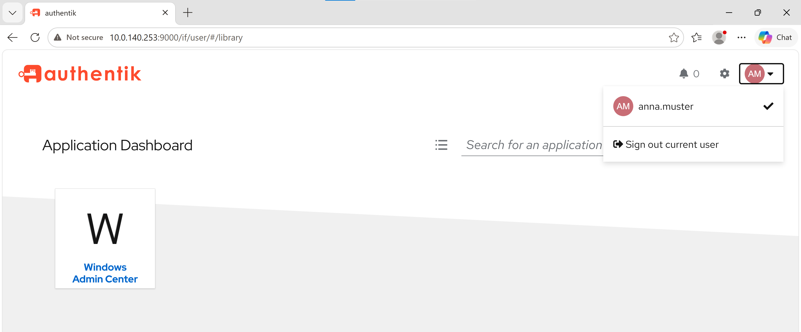
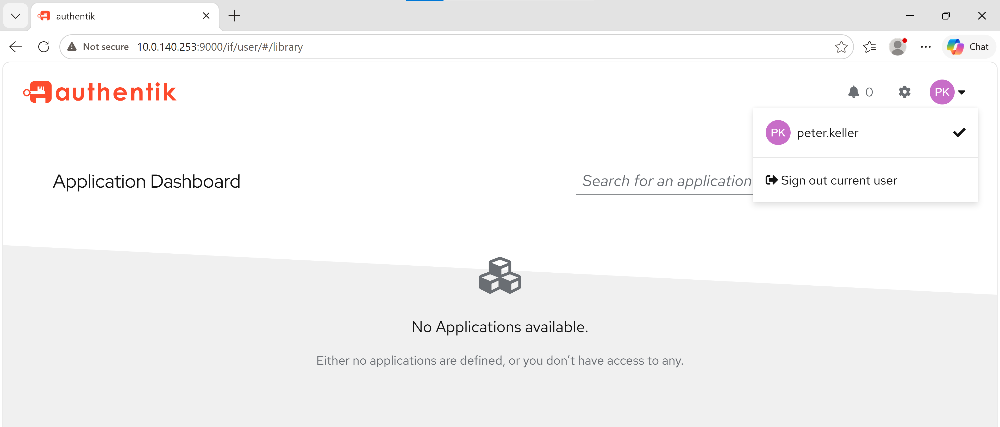
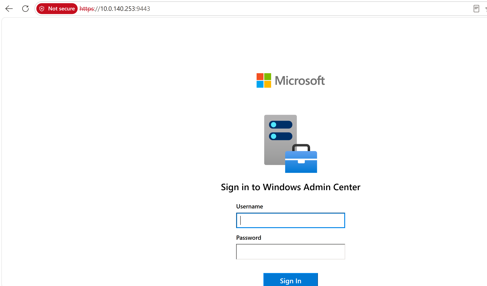

<div align="right">


</div>

<div align="center">

# Auftrag 06: RSAT & Admin Center V2

<!--
Farblogik (Phase): offen=lightgrey · in-arbeit=d29922 (amber) · fertig=1b7f79 (teal) · Kompetenzfelder=58a6ff (blau, neutral)
-->


**[Ziel](#ziel) · [Vorgehen](#vorgehen) · [Nachweise](#nachweise) · [Checkliste](#checkliste)**

</div>

---

> Direkt im Anschluss an [Auftrag 05](../05-aws-managed-ad/README.md) durchgeführt, in **Variante B** (Authentik statt AWS Managed Microsoft AD), aus dem gleichen Grund wie dort (Kostenkontrolle, bewusst ans Ende verschoben).

<h2 id="ziel"><font color="#8250df">Ziel</font></h2>

> RSAT-Tools zur Verwaltung installieren, Windows Admin Center V2 einrichten, den bestehenden Domain Controller (DC01) im Admin Center verwalten und von aussen sicher (über Authentik SSO statt offenem Zugriff) erreichbar machen.

<br>

> Ein Teil der Infrastruktur stand durch Auftrag 05 und Auftrag 08 bereits als Nebenprodukt: Windows Admin Center läuft auf AdminCenter01 bereits samt SSO-Proxy über Authentik (Auftrag 05), RSAT-AD-Tools waren dort für `ldp.exe` bereits installiert (Auftrag 08). Dieser Auftrag schliesst die verbleibenden Punkte: volle RSAT-Suite bestätigen, DC01 formell im Admin Center verifizieren, WinRM-Zugriff einschränken, externe Erreichbarkeit gezielt für diesen Auftrag erneut nachweisen.

<h2 id="vorgehen"><font color="#8250df">Vorgehen</font></h2>

<details open>
<summary><strong>1. RSAT verifizieren</strong></summary>

```powershell
Get-WindowsFeature RSAT-AD*
```

Alle RSAT-AD-Features bereits `Installed` (Nebenprodukt aus Auftrag 08). Keine Nachinstallation nötig, vollständig bestätigt.



*`Get-WindowsFeature RSAT-AD*`, alle Features installiert.*

</details>

<details open>
<summary><strong>2. Windows Admin Center Version prüfen</strong></summary>

WAC-GUI → Settings → "?"-Icon oben rechts → About Windows Admin Center. Version 2606, Build 2.7.5.21, bestätigt Gateway-Modus V2 (Nebenprodukt aus Auftrag 05).



*About-Dialog, Version 2606 (Build 2.7.5.21), Gateway-Modus V2.*

</details>

<details open>
<summary><strong>3. DC01 im Admin Center</strong></summary>

DC01 war als Connection bereits eingetragen. Verbindung durch Anklicken verifiziert: Overview-Seite lädt live CPU-, Memory- und Netzwerkdaten von `dc01.ad.contoso.com`, Zugriff funktioniert einwandfrei.



*Overview von DC01 im Admin Center, live Monitoring-Daten bestätigen funktionierende Verbindung.*

</details>

<details open>
<summary><strong>4. WinRM-Ports einschränken</strong></summary>

Vor der Änderung erlaubte DC01s Security Group die Ports 5985 (WinRM-HTTP) und 5986 (WinRM-HTTPS) aus dem gesamten VPC-CIDR `10.0.0.0/16`, deutlich weiter gefasst als nötig. Beide Regeln auf AdminCenter01s private IP als `/32` eingeschränkt:

| Port | Vorher | Nachher |
|---|---|---|
| 5985 (WinRM-HTTP) | `10.0.0.0/16` | `10.0.0.30/32` |
| 5986 (WinRM-HTTPS) | `10.0.0.0/16` | `10.0.0.30/32` |

Alle anderen Regeln (LDAP, SMB, Kerberos, Global Catalog, RPC) unverändert gelassen, die brauchen weiterhin domänenweiten Zugriff. Nach der Änderung erneut die DC01-Overview-Seite im Admin Center neu geladen, weiterhin fehlerfrei erreichbar, bestätigt korrekte Quelladresse.



*Inbound Rules nach Einschränkung, 5985 und 5986 nur noch aus `10.0.0.30/32`.*



*DC01-Overview nach Einschränkung weiterhin funktionsfähig, nur noch von AdminCenter01 aus.*

</details>

<details open>
<summary><strong>5. Externe Erreichbarkeit über Authentik SSO</strong></summary>

Test von Client01 aus (eigene Elastic IP, echter Zugriff von aussen, nicht innerhalb der AdminCenter01-Sitzung), gegen die Authentik-Proxy-URL `https://10.0.140.253:9443`, mit zwei Testbenutzern:

- **anna.muster** (Mitglied `SSO-WAC-Users`): sieht im Authentik-Dashboard die Kachel "Windows Admin Center", Klick führt bis zur WAC-Login-Seite, Proxy leitet korrekt durch.
- **peter.keller** (nicht Mitglied): Dashboard zeigt "No Applications available", WAC ist für ihn gar nicht erst sichtbar, noch bevor überhaupt eine Anmeldemaske erscheint.



*anna.muster sieht die Windows-Admin-Center-Kachel.*



*peter.keller sieht keine Anwendungen, Zugriff korrekt verweigert.*



*Von Client01 aus über den Authentik-Proxy bis zur WAC-Login-Seite durchgekommen.*

</details>

<br>

<h2 id="nachweise"><font color="#8250df">Nachweise</font></h2>

<details open>
<summary><strong>Screenshots anzeigen</strong></summary>

<br>

| Screenshot | Beschreibung |
|---|---|
| [01-wac-version.png](./00-screenshots/01-wac-version.png) | WAC About-Dialog, Version 2606, Build 2.7.5.21 |
| [02-rsat-features.png](./00-screenshots/02-rsat-features.png) | `Get-WindowsFeature RSAT-AD*`, alle Features installiert |
| [03-dc01-connected.png](./00-screenshots/03-dc01-connected.png) | DC01 im Admin Center, live Monitoring-Daten |
| [04-winrm-security-group.png](./00-screenshots/04-winrm-security-group.png) | Inbound Rules, WinRM-Ports auf AdminCenter01-IP eingeschränkt |
| [05-dc01-nach-einschraenkung.png](./00-screenshots/05-dc01-nach-einschraenkung.png) | DC01-Overview nach Einschränkung weiterhin funktionsfähig |
| [06-sso-anna-zugriff-erlaubt.png](./00-screenshots/06-sso-anna-zugriff-erlaubt.png) | anna.muster sieht WAC-Kachel in Authentik |
| [07-sso-peter-zugriff-verweigert.png](./00-screenshots/07-sso-peter-zugriff-verweigert.png) | peter.keller ohne verfügbare Anwendungen |
| [08-wac-proxy-login-extern.png](./00-screenshots/08-wac-proxy-login-extern.png) | WAC-Login-Seite über Authentik-Proxy, von Client01 aus |

</details>

<br>

<h2 id="checkliste"><font color="#8250df">Checkliste</font></h2>

- [x] Auftrag gestartet (direkt nach Auftrag 05, Variante B)
- [x] RSAT installiert (verifiziert, Nebenprodukt aus Auftrag 08)
- [x] Admin Center V2 eingerichtet (verifiziert, Nebenprodukt aus Auftrag 05, Version 2606 bestätigt)
- [x] DC01 im Admin Center hinzugefügt und Verbindung verifiziert
- [x] WinRM-Zugriff auf AdminCenter01-IP eingeschränkt (5985/5986, vorher ganzes VPC-CIDR)
- [x] Von aussen erreichbar über Authentik SSO, Zugriffskontrolle mit zwei Testbenutzern verifiziert
- [x] Umsetzung abgeschlossen
- [x] Screenshots/Nachweise abgelegt
- [x] `ki-log.md` ausgefüllt
- [x] `entscheidungsprotokoll.md` ausgefüllt (bestehende Infrastruktur statt neuer EC2-Instanz)
- [x] EC2-Instanzen nach Abschluss gestoppt (Kostenkontrolle, kein separater AWS-Managed-AD-Service in Variante B vorhanden)

<br>

<h2 id="verweise"><font color="#8250df">Verweise</font></h2>

| Datei | Inhalt |
|---|---|
| [ki-log.md](./ki-log.md) | KI-Nutzung in diesem Auftrag |
| [entscheidungsprotokoll.md](./entscheidungsprotokoll.md) | Begründung des Entscheids in diesem Auftrag |
| [Auftragsstellung (Modul-Repo)](https://ch-tbz-it.gitlab.io/Stud/m159/03-auftraege/06-rsat-admin-center-v2/) | Offizielle Aufgabenstellung |
| [Fragenkatalog (Modul-Repo)](https://ch-tbz-it.gitlab.io/Stud/m159/03-auftraege/06-rsat-admin-center-v2/fragen.html) | Vorbereitung mündlicher Nachweis |

<br>

<div align="center">

⬅️ [Auftrag 05: AWS Managed Microsoft AD](../05-aws-managed-ad/README.md) · 🏠 [Übersicht](../README.md) · ➡️ [Auftrag 07: DIT & GPOs](../07-dit-gpos/README.md)

</div>
