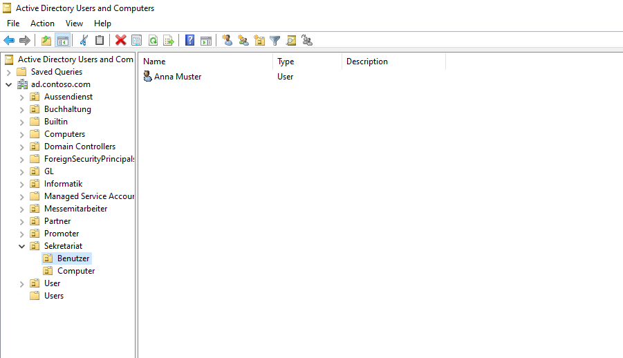
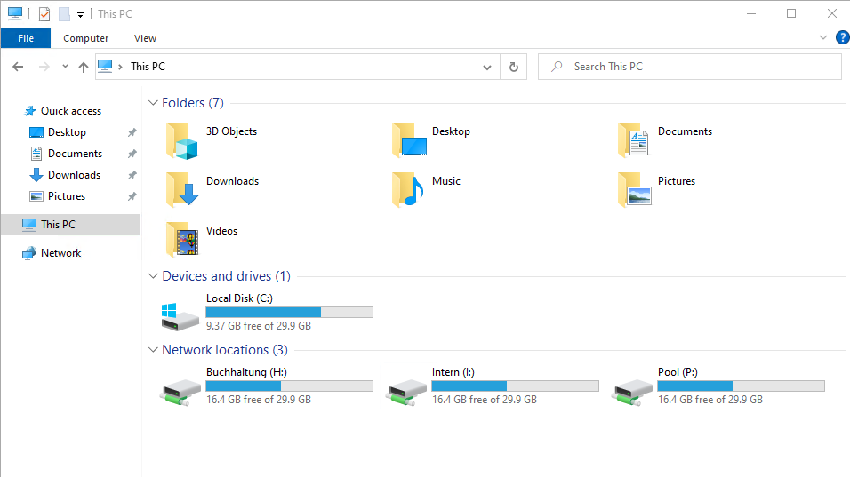
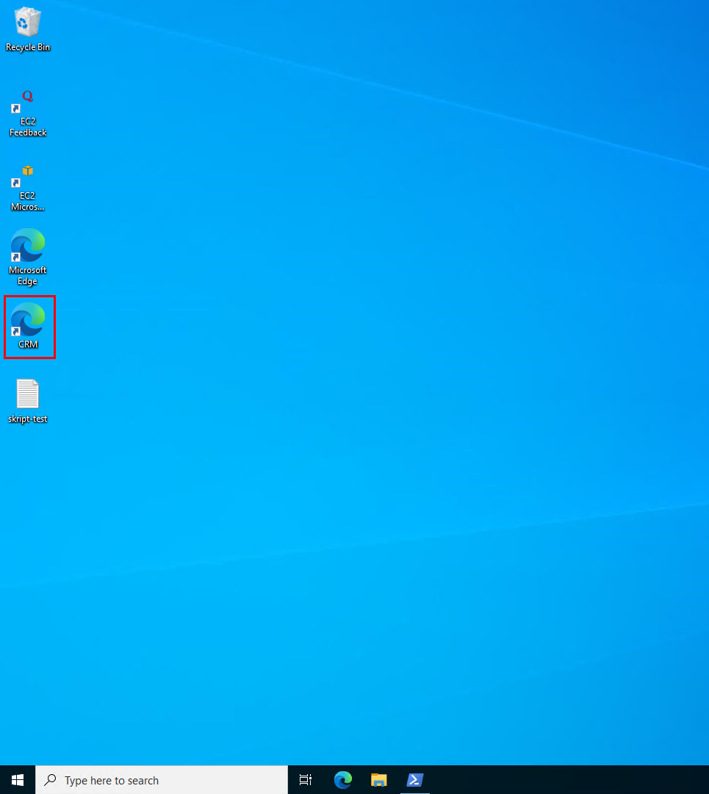
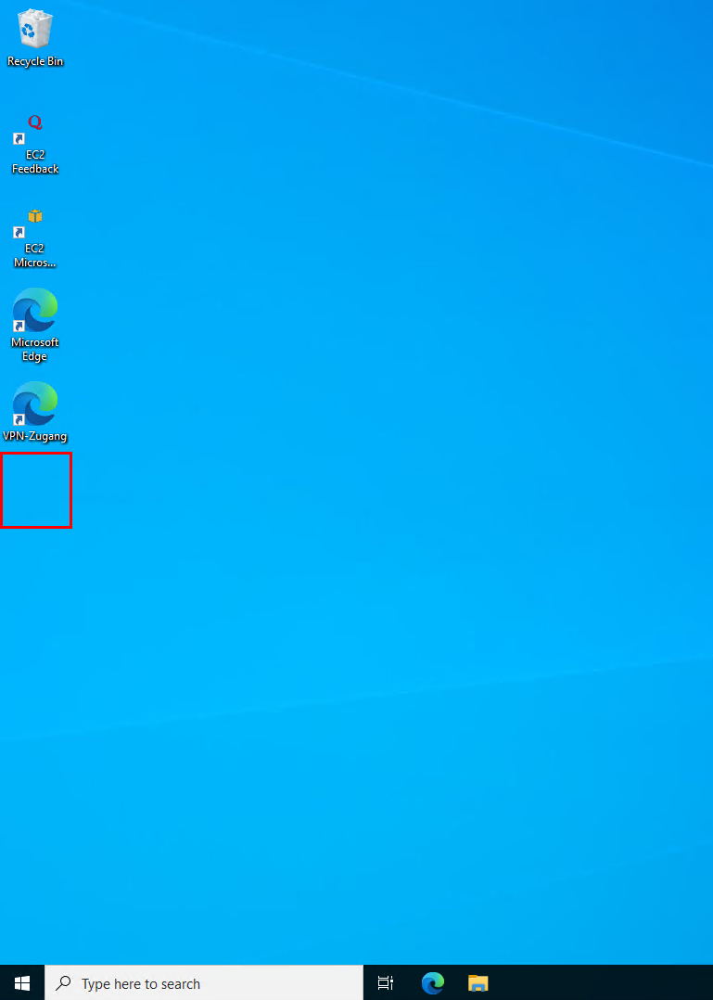
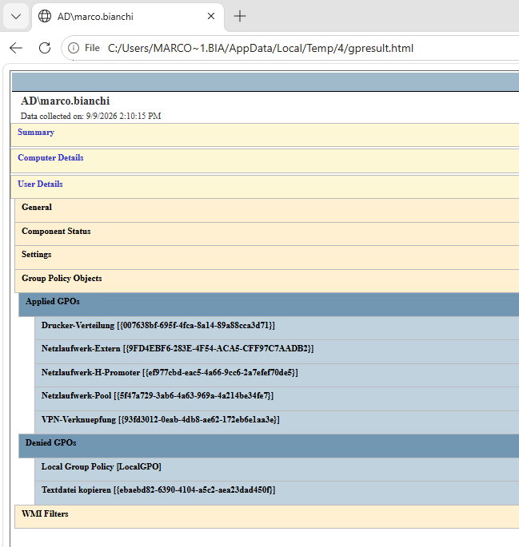
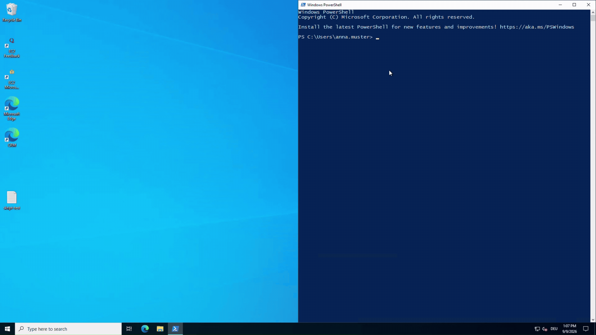
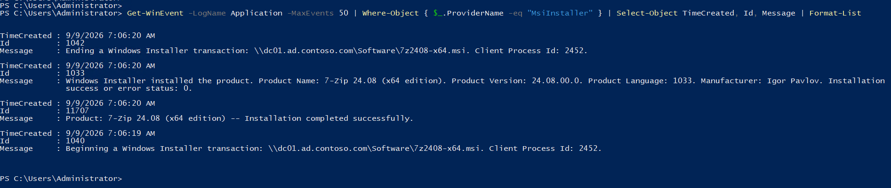

<div align="right">


</div>

<div align="center">

# Auftrag 07: DIT & GPOs

<!--
Farblogik (Phase): offen=lightgrey · in-arbeit=d29922 (amber) · fertig=1b7f79 (teal) · Kompetenzfelder=58a6ff (blau, neutral)
-->


**[Ziel](#ziel) · [DIT](#dit) · [Vorgehen](#vorgehen) · [Nachweise](#nachweise) · [Checkliste](#checkliste)**

</div>

---

<h2 id="ziel"><font color="#8250df">Ziel</font></h2>

> Den Directory Information Tree (DIT) sinnvoll nach Abteilungen strukturieren, dabei Benutzer und Computer je Abteilung in eigenen Unter-OUs trennen, und sechs verschiedene Group-Policy-Szenarien umsetzen: Passwortrichtlinie, Netzlaufwerke, Desktop-Verknüpfung mit positiver Sicherheitsfilterung, WMI-gefilterte Verteilung, Druckerverteilung und Softwareverteilung mit Item-Level-Targeting.

<br>

<h2 id="dit"><font color="#8250df">DIT</font></h2>

Ein OU-Baum pro Abteilung (nicht dupliziert nach intern und extern), passend zu den acht Abteilungsgruppen aus [Auftrag 04](../04-freigaben-berechtigungen/README.md). Jede Abteilungs-OU hat zwei Unter-OUs, `Benutzer` und `Computer`, damit sich GPOs später gezielt nur auf Benutzerkonten oder nur auf Computerkonten einer Abteilung anwenden lassen, ohne beide Kontotypen zu vermischen.

<picture>
  <source media="(prefers-color-scheme: dark)" srcset="../00-files/assets/dit-diagramm-dark.png">
  
</picture>

Alle acht Testbenutzer aus Auftrag 04 wurden in die passende `Benutzer`-Unter-OU ihrer Abteilung verschoben:

```powershell
$abteilungen = @("GL","Sekretariat","Buchhaltung","Informatik","Messemitarbeiter","Aussendienst","Promoter","Partner")
foreach ($abt in $abteilungen) {
    New-ADOrganizationalUnit -Name $abt -Path "DC=ad,DC=contoso,DC=com" -ProtectedFromAccidentalDeletion $true
    New-ADOrganizationalUnit -Name "Benutzer" -Path "OU=$abt,DC=ad,DC=contoso,DC=com" -ProtectedFromAccidentalDeletion $true
    New-ADOrganizationalUnit -Name "Computer" -Path "OU=$abt,DC=ad,DC=contoso,DC=com" -ProtectedFromAccidentalDeletion $true
}

$zuordnung = @{
    "Anna Muster" = "Sekretariat"; "Peter Keller" = "Buchhaltung"; "Sandra Weber" = "GL"
    "Marco Bianchi" = "Promoter"; "Laura Frei" = "Aussendienst"; "Thomas Steiner" = "Partner"
    "Nina Huber" = "Informatik"; "David Roth" = "Messemitarbeiter"
}
foreach ($name in $zuordnung.Keys) {
    $abt = $zuordnung[$name]
    $user = Get-ADUser -Filter "Name -eq '$name'"
    Move-ADObject -Identity $user.DistinguishedName -TargetPath "OU=Benutzer,OU=$abt,DC=ad,DC=contoso,DC=com"
}
```



*ADUC, alle acht Abteilungs-OUs mit Benutzer-/Computer-Trennung, hier am Beispiel Sekretariat aufgeklappt.*

<br>

<h2 id="vorgehen"><font color="#8250df">Vorgehen</font></h2>

<details open>
<summary><strong>1. Passwortrichtlinie</strong></summary>

Die Passwortkomplexität und die maximale Passwortlaufzeit in der Default Domain Policy sollten deaktiviert werden. Der Group-Policy-Editor hat die Änderung zwar im Dialog angenommen, beim Speichern kam aber ein Fehler ("The system cannot find the file specified", beim Schreiben von `GptTmpl.inf` auf SYSVOL), und die Kontrolle danach zeigte, dass die Werte tatsächlich nicht übernommen worden waren. DFSR-Replikation und die lokale Datei sahen dabei unauffällig aus, die genaue Ursache liess sich nicht abschliessend klären.

Da für die Passwortrichtlinie ein direktes PowerShell-Cmdlet existiert, wurde die GPO-GUI umgangen und die Richtlinie direkt auf Domänenebene gesetzt:

```powershell
Set-ADDefaultDomainPasswordPolicy -Identity "ad.contoso.com" -ComplexityEnabled $false -MaxPasswordAge 0
```

```powershell
Get-ADDefaultDomainPasswordPolicy
```

```
ComplexityEnabled : False
MaxPasswordAge    : 00:00:00
```

</details>

<details open>
<summary><strong>2. Netzlaufwerke</strong></summary>

Vier Laufwerksbuchstaben nach Zweck vergeben: `P:` für einen gemeinsamen Pool-Ordner (alle Abteilungen), `I:` für interne Abteilungen, `E:` für externe Abteilungen, `H:` als persönliches Abteilungslaufwerk (pro Abteilung ein eigener Ziel-Pfad, aber immer derselbe Laufwerksbuchstabe `H:`). Dafür wurden elf einzelne GPOs erstellt statt einer grossen GPO mit mehreren Einträgen, weil sich so jede Zielgruppe unabhängig verwalten lässt (z. B. eine einzelne Abteilung aus der internen Verteilung herauslösen, ohne die anderen zehn GPOs anzufassen):

```powershell
Import-Module GroupPolicy

New-GPO -Name "Netzlaufwerk-Pool" | New-GPLink -Target "DC=ad,DC=contoso,DC=com"

$internAbteilungen = @("Sekretariat","Buchhaltung","GL","Informatik","Messemitarbeiter")
New-GPO -Name "Netzlaufwerk-Intern"
foreach ($abt in $internAbteilungen) { New-GPLink -Name "Netzlaufwerk-Intern" -Target "OU=$abt,DC=ad,DC=contoso,DC=com" }

$externAbteilungen = @("Promoter","Aussendienst","Partner")
New-GPO -Name "Netzlaufwerk-Extern"
foreach ($abt in $externAbteilungen) { New-GPLink -Name "Netzlaufwerk-Extern" -Target "OU=$abt,DC=ad,DC=contoso,DC=com" }

$alleAbteilungen = @("GL","Sekretariat","Buchhaltung","Informatik","Messemitarbeiter","Aussendienst","Promoter","Partner")
foreach ($abt in $alleAbteilungen) {
    New-GPO -Name "Netzlaufwerk-H-$abt" | New-GPLink -Target "OU=$abt,DC=ad,DC=contoso,DC=com"
}
```

Die eigentliche Drive-Map-Einstellung (User Configuration, Preferences, Windows Settings, Drive Maps) wurde in jeder GPO über die GUI ergänzt, mit dem jeweils passenden UNC-Pfad und Laufwerksbuchstaben. Mit dem Testbenutzer peter.keller (Buchhaltung) end-to-end verifiziert.



*peter.keller sieht nach Anmeldung korrekt H: (Buchhaltung), I: (Intern) und P: (Pool).*

</details>

<details open>
<summary><strong>3. Desktop-Verknüpfung mit positiver Sicherheitsfilterung</strong></summary>

Eine Desktop-Verknüpfung zu einem internen Web-CRM (`https://crm.webapp.ch`) sollte nur bei intern arbeitenden Benutzern erscheinen, nicht bei extern arbeitenden. Die GPO wurde an die gesamte Domäne verlinkt und die Einschränkung ausschliesslich über Security Filtering (positive Filterung) gesteuert, nicht über die OU-Verknüpfung selbst.

Der erste Versuch, die Security Filtering auf die übergeordnete Gruppe `Intern` zu setzen (statt auf jede der fünf internen Abteilungsgruppen einzeln), führte zu einem hartnäckigen Fehler: Die GPO erschien beim Testbenutzer anna.muster (Mitglied von Sekretariat, welches wiederum Mitglied von Intern ist) weder in den angewendeten noch in den durch Filterung verweigerten GPOs von `gpresult`, obwohl ihr Kerberos-Token die Gruppe `Intern` nachweislich enthielt (bestätigt mit `whoami /groups`). Das Event-Log (`Microsoft-Windows-GroupPolicy/Operational`, Event ID 5312) zeigte, dass der Domänencontroller diese GPO für ihre Sitzung überhaupt nicht in Betracht zog, es war also kein clientseitiges Filterungsproblem, sondern eine serverseitige Auflösung, die verschachtelte Gruppenmitgliedschaft in der Security Filtering nicht korrekt berücksichtigte.

Die Lösung war, die Security Filtering direkt auf die fünf internen Abteilungsgruppen zu setzen, statt auf die übergeordnete Sammelgruppe:

```powershell
New-GPO -Name "Desktop-Link-CRM" | New-GPLink -Target "DC=ad,DC=contoso,DC=com"

Set-GPPermission -Name "Desktop-Link-CRM" -TargetName "Intern" -TargetType Group -PermissionLevel None
Set-GPPermission -Name "Desktop-Link-CRM" -TargetName "Sekretariat" -TargetType Group -PermissionLevel GpoApply
Set-GPPermission -Name "Desktop-Link-CRM" -TargetName "Buchhaltung" -TargetType Group -PermissionLevel GpoApply
Set-GPPermission -Name "Desktop-Link-CRM" -TargetName "GL" -TargetType Group -PermissionLevel GpoApply
Set-GPPermission -Name "Desktop-Link-CRM" -TargetName "Informatik" -TargetType Group -PermissionLevel GpoApply
Set-GPPermission -Name "Desktop-Link-CRM" -TargetName "Messemitarbeiter" -TargetType Group -PermissionLevel GpoApply
```

Für die Verknüpfung selbst wäre die naheliegende Umsetzung eine Preferences-Shortcut gewesen (User Configuration, Preferences, Windows Settings, Shortcuts). Auf Client01 fehlte dafür allerdings die zuständige Client Side Extension (`{CEFFA6E2-E3BD-421B-852C-6F6A79A59BC1}`) im Registry-Pfad `HKLM:\SOFTWARE\Microsoft\Windows NT\CurrentVersion\Winlogon\GPExtensions`, auch nach erneuter Installation des GPMC-Features und einem Neustart blieb sie abwesend. Als funktionierende Alternative wurde stattdessen ein klassisches PowerShell-Logon-Script verwendet (User Configuration, Policies, Windows Settings, Scripts, Logon):

```powershell
$shell = New-Object -ComObject WScript.Shell
$shortcut = $shell.CreateShortcut("$env:USERPROFILE\Desktop\CRM.url")
$shortcut.TargetPath = "https://crm.webapp.ch"
$shortcut.Save()
```

Eine weitere wichtige Erkenntnis während der Fehlersuche: `gpupdate /force`, selbst mit `/boot`, aktualisiert eine bereits offene Sitzung nicht zuverlässig, weder für Logon-Scripts noch für Preferences. Erst ein vollständiges Ab- und wieder Anmelden hat die GPO-Anwendung zuverlässig ausgelöst.



*anna.muster (Sekretariat, intern) hat die CRM-Verknüpfung auf dem Desktop.*



*marco.bianchi (Promoter, extern) hat keine CRM-Verknüpfung.*

</details>

<details open>
<summary><strong>4. WMI-gefilterte Dateiverteilung</strong></summary>

Eine Testdatei sollte per GPO in die Promoter-OU verteilt werden, aber nur auf echten Windows-10-Rechnern, nicht auf Server-Betriebssystemen. Da im Setup ausschliesslich Windows-Server-Clients vorhanden sind, ist gemäss offizieller Aufgabenstellung der negative, korrekt blockierte Fall ein gültiger Nachweis, es wird keine echte Windows-10-Maschine benötigt.

WMI-Filter mit der Abfrage `SELECT * FROM Win32_OperatingSystem WHERE Version LIKE "10.0%" AND ProductType = "1"` erstellt. `ProductType = "1"` steht für Workstation/Client-Betriebssysteme und schliesst Server 2022 korrekt aus, obwohl dieses ebenfalls die Versionsnummer "10.0" trägt.

```powershell
"Dies ist die WMI-Filter Testdatei fuer Auftrag 07, Teil 4." | Out-File -FilePath "C:\Daten\Pool\WMI-Filter.txt" -Encoding UTF8

New-GPO -Name "Textdatei kopieren" | New-GPLink -Target "OU=Promoter,DC=ad,DC=contoso,DC=com"

$gpoIdCopy = (Get-GPO -Name "Textdatei kopieren").Id.Guid
$copyScript = @'
Copy-Item -Path "\\dc01.ad.contoso.com\Pool\WMI-Filter.txt" -Destination "$env:TEMP\WMI-Filter.txt" -Force
'@
New-Item -Path "C:\Windows\SYSVOL\domain\Policies\{$gpoIdCopy}\User\Scripts\Logon" -ItemType Directory -Force
$copyScript | Out-File -FilePath "C:\Windows\SYSVOL\domain\Policies\{$gpoIdCopy}\User\Scripts\Logon\copy-wmi-file.ps1" -Encoding UTF8
```

Der WMI-Filter wurde über die GUI erstellt (`gpmc.msc`, WMI Filters, New) und im Scope-Tab der GPO "Textdatei kopieren" zugewiesen. Mit dem Testbenutzer marco.bianchi (Promoter, auf Server 2022) verifiziert: Die Datei wurde korrekt nicht kopiert, und `gpresult` zeigt die GPO unter den durch WMI-Filter verweigerten Objekten.



*`gpresult`, "Textdatei kopieren" korrekt als verweigert markiert, weil Client01 ein Server-Betriebssystem ist.*

</details>

<details open>
<summary><strong>5. Druckerverteilung</strong></summary>

Zwei simulierte Netzwerkdrucker (Farbe und Schwarzweiss) sollten per GPO domänenweit verteilt werden. Da keine echte Druckerhardware vorhanden ist, wurden die Drucker mit dem generischen Microsoft-PS-Class-Treiber und frei gewählten IP-Adressen als Ports simuliert.

```powershell
Install-WindowsFeature -Name Print-Server -IncludeManagementTools
# Neue PowerShell-Session, damit das Druckmodul geladen wird

Add-PrinterDriver -Name "Microsoft PS Class Driver"

Add-PrinterPort -Name "IP_192.168.1.200" -PrinterHostAddress "192.168.1.200"
Add-Printer -Name "Laserdrucker-Farbe" -DriverName "Microsoft PS Class Driver" -PortName "IP_192.168.1.200" -Shared -ShareName "Laserdrucker-Farbe"

Add-PrinterPort -Name "IP_192.168.1.201" -PrinterHostAddress "192.168.1.201"
Add-Printer -Name "Laserdrucker-SW" -DriverName "Microsoft PS Class Driver" -PortName "IP_192.168.1.201" -Shared -ShareName "Laserdrucker-SW"
```

Beide Drucker wurden über die GPO "Drucker-Verteilung" (User Configuration, Preferences, Control Panel Settings, Printers) mit ihrem UNC-Pfad hinzugefügt und die GPO an die gesamte Domäne verlinkt. Die Preferences-XML auf SYSVOL (`Printers.xml`) enthielt von Anfang an den korrekten Inhalt für beide Drucker, trotzdem blieb `Get-GPO`s `UserVersion` leer und Clients erkannten die Änderung nicht.

Die Ursache war dieselbe Klasse von Problem wie bei der Passwortrichtlinie in Teil 1: Der SYSVOL-Inhalt war korrekt, aber die AD-seitigen Versionsmetadaten der GPO wurden nie aktualisiert. Für Printer Preferences existiert kein direktes Ersatz-Cmdlet wie bei der Passwortrichtlinie, daher musste die Ursache direkt behoben werden. `versionNumber` (ein Attribut des `groupPolicyContainer`-Objekts in AD) ist eine kombinierte 32-Bit-Zahl, deren obere 16 Bit die Computer-Version und deren untere 16 Bit die User-Version codieren:

```powershell
$gpoIdPrinter = (Get-GPO -Name "Drucker-Verteilung").Id.Guid
$obj = Get-ADObject -Identity "CN={$gpoIdPrinter},CN=Policies,CN=System,DC=ad,DC=contoso,DC=com" -Properties versionNumber
$v = $obj.versionNumber
$computerVersion = ($v -shr 16) -band 0xFFFF
$userVersion = $v -band 0xFFFF
```

Der Vergleich zeigte, dass die `Version=`-Zeile in `gpt.ini` auf SYSVOL einen anderen Rohwert enthielt als `versionNumber` in AD. Nachdem `gpt.ini` manuell auf denselben Rohwert wie AD gesetzt wurde, hat die Anwendung auf dem Client (nach `gpupdate /force` und vollständigem Ab-/Anmelden) funktioniert, obwohl `Get-GPO`s `UserVersion`/`ComputerVersion`-Anzeige selbst danach weiterhin leer blieb. Dieser Anzeigefehler des Cmdlets hatte also keinen Einfluss auf die tatsächliche Funktion, was sich nur durch einen direkten Test am Client feststellen liess, nicht durch die GPMC-Anzeige.

Verifiziert mit dem Testbenutzer anna.muster: Beide Netzwerkdrucker erscheinen nach Ab-/Anmeldung korrekt als verbundene Drucker.

```
\\dc01.ad.contoso.com\Laserdrucker-Farbe   dc01.ad.contoso.com   Connection
\\dc01.ad.contoso.com\Laserdrucker-SW      dc01.ad.contoso.com   Connection
```

Video-Nachweis: beide Drucker wurden vor der Aufnahme entfernt, danach im Video `gpupdate /force` ausgeführt und mit `Get-Printer` gezeigt, dass beide Drucker durch die GPO neu verteilt wurden.



*Video-Nachweis: `Get-Printer` vorher (leer), `gpupdate /force`, `Get-Printer` nachher (beide Laserdrucker wieder vorhanden).*

</details>

<details open>
<summary><strong>6. Softwareverteilung mit Item-Level-Targeting</strong></summary>

7-Zip sollte per GPO nur an Computer verteilt werden, die Mitglied einer eigens dafür erstellten Sicherheitsgruppe sind, gesteuert über Item-Level-Targeting. Zuerst wurden eine Freigabe für das Installationspaket und die Zielgruppe angelegt:

```powershell
New-Item -Path "C:\Daten\Software" -ItemType Directory -Force
New-SmbShare -Name "Software" -Path "C:\Daten\Software" -FullAccess "Domain Admins" -ReadAccess "Everyone"
icacls "C:\Daten\Software" /grant "Everyone:(OI)(CI)RX"

Invoke-WebRequest -Uri "https://www.7-zip.org/a/7z2408-x64.msi" -OutFile "C:\Daten\Software\7z2408-x64.msi" -UseBasicParsing

New-ADGroup -Name "7-Zip" -GroupScope Global -GroupCategory Security -Path "DC=ad,DC=contoso,DC=com"
Add-ADGroupMember -Identity "7-Zip" -Members "CLIENT01$"
```

Sowohl die Freigabe- als auch die NTFS-Leseberechtigung für "Everyone" (auf diesem englischsprachigen System das Äquivalent zu "Jeder") wurden von Anfang an gesetzt, um den in der Aufgabenstellung erwähnten Fehler %%1274 (fehlende Leseberechtigung auf der Softwarefreigabe) zu vermeiden.

**Abweichung von der naheliegenden Umsetzung, mit Begründung:** Die Aufgabenstellung verlangt eine Installation über Computer Configuration mit Item-Level-Targeting. Der dafür naheliegende Mechanismus wäre das Preferences-Element "Applications" (Control Panel Settings, Applications), das eine MSI-Installation direkt mit einem eigenen Item-Level-Targeting-Tab kombiniert. Eine Prüfung des Group-Policy-Management-Editors zeigte jedoch, dass dieses Element bei der eingesetzten Windows-Version ausschliesslich unter User Configuration existiert, es gibt dort kein Pendant unter Computer Configuration (ebenso wenig wie bei "Drive Maps"). Da die Aufgabenstellung ausdrücklich eine computer- statt benutzerbezogene Installation verlangt, wurde stattdessen der Scheduled-Tasks-Preference-Typ verwendet (Computer Configuration, Preferences, Control Panel Settings, Scheduled Tasks), der ebenfalls über den regulären Item-Level-Targeting-Mechanismus auf dem Reiter "Common" verfügt. Damit bleibt sowohl die geforderte Computer Configuration als auch das geforderte Item-Level-Targeting erhalten, nur der Trägertyp des Preference-Items unterscheidet sich vom naheliegendsten Fall.

Die geplante Aufgabe wurde als "Immediate Task" mit folgenden Einstellungen erstellt: Ausführung als `NT AUTHORITY\SYSTEM`, unabhängig davon ob ein Benutzer angemeldet ist, mit der Aktion `msiexec.exe /i \\dc01.ad.contoso.com\Software\7z2408-x64.msi /qn`. Das Item-Level-Targeting auf dem Reiter "Common" wurde auf "Computer in group" mit der Gruppe `AD\7-Zip` gesetzt.

```powershell
New-GPO -Name "7-Zip-Verteilung" | New-GPLink -Target "DC=ad,DC=contoso,DC=com"
```

Nach vollständigem Neustart von Client01 (Computer-Configuration-Preferences werden beim Systemstart verarbeitet, ein einfaches `gpupdate /force` reicht nicht) wurde die erfolgreiche Installation sowohl über `Get-Package` als auch über das Ereignisprotokoll bestätigt:

```powershell
Get-Package -Name "*7-Zip*"
Get-WinEvent -LogName Application -MaxEvents 50 | Where-Object { $_.ProviderName -eq "MsiInstaller" }
```

```
Windows Installer installed the product. Product Name: 7-Zip 24.08 (x64 edition). Product Version: 24.08.00.0.
Installation success or error status: 0.

Product: 7-Zip 24.08 (x64 edition) -- Installation completed successfully.
```



*Ereignisprotokoll bestätigt die erfolgreiche Installation von 7-Zip 24.08 auf Client01.*

</details>

<br>

<h2 id="nachweise"><font color="#8250df">Nachweise</font></h2>

<details open>
<summary><strong>Screenshots anzeigen</strong></summary>

<br>

| Screenshot | Beschreibung |
|---|---|
| [01-ou-struktur.png](./00-screenshots/01-ou-struktur.png) | ADUC mit allen acht Abteilungs-OUs und Benutzer-/Computer-Trennung |
| [02-netzlaufwerke-buchhaltung.png](./00-screenshots/02-netzlaufwerke-buchhaltung.png) | Gemappte Laufwerke H, I, P bei peter.keller |
| [03-crm-link-anna-intern.png](./00-screenshots/03-crm-link-anna-intern.png) | CRM-Verknüpfung bei anna.muster (intern) sichtbar |
| [04-crm-link-marco-extern.png](./00-screenshots/04-crm-link-marco-extern.png) | CRM-Verknüpfung bei marco.bianchi (extern) nicht vorhanden |
| [05-wmi-filter-denied-gpo.png](./00-screenshots/05-wmi-filter-denied-gpo.png) | gpresult: GPO korrekt durch WMI-Filter verweigert auf Server 2022 |
| [06-7zip-eventlog.png](./00-screenshots/06-7zip-eventlog.png) | Ereignisprotokoll bestätigt erfolgreiche 7-Zip-Installation |
| [07-druckerverteilung-nachweis.gif](./00-screenshots/07-druckerverteilung-nachweis.gif) | Video-Nachweis (GIF): Drucker entfernt, `gpupdate /force`, Drucker wieder vorhanden |

</details>

<br>

<h2 id="checkliste"><font color="#8250df">Checkliste</font></h2>

- [x] DIT-Diagramm erstellt
- [x] OU-Struktur mit Benutzer-/Computer-Trennung je Abteilung umgesetzt
- [x] Teil 1: Passwortrichtlinie
- [x] Teil 2: Netzlaufwerke
- [x] Teil 3: Desktop-Verknüpfung mit positiver Sicherheitsfilterung
- [x] Teil 4: WMI-gefilterte Dateiverteilung
- [x] Teil 5: Druckerverteilung (inkl. Video-Nachweis)
- [x] Teil 6: Softwareverteilung mit Item-Level-Targeting
- [x] Screenshots/Nachweise abgelegt
- [x] `ki-log.md` ausgefüllt

<br>

<h2 id="verweise"><font color="#8250df">Verweise</font></h2>

| Datei | Inhalt |
|---|---|
| [ki-log.md](./ki-log.md) | KI-Nutzung in diesem Auftrag |
| [Auftragsstellung (Modul-Repo)](https://ch-tbz-it.gitlab.io/Stud/m159/03-auftraege/07-dit-gpos/) | Offizielle Aufgabenstellung |
| [Fragenkatalog (Modul-Repo)](https://ch-tbz-it.gitlab.io/Stud/m159/03-auftraege/07-dit-gpos/fragen.html) | Vorbereitung mündlicher Nachweis |

<br>

<div align="center">

⬅️ [Auftrag 06: RSAT & Admin Center V2](../06-rsat-admin-center/README.md) · 🏠 [Übersicht](../README.md) · ➡️ [Auftrag 08: Suche im Directory (LDAP)](../08-suche-im-directory/README.md)

</div>
