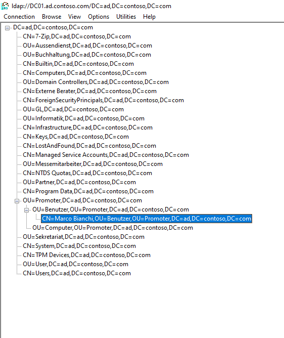
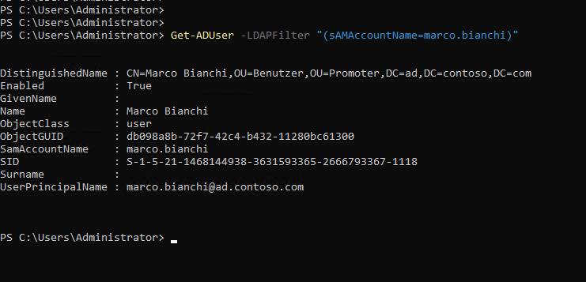
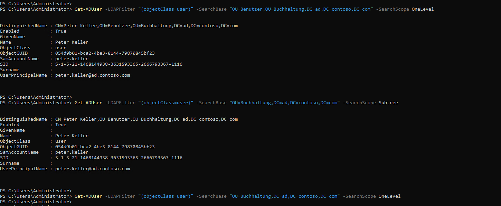
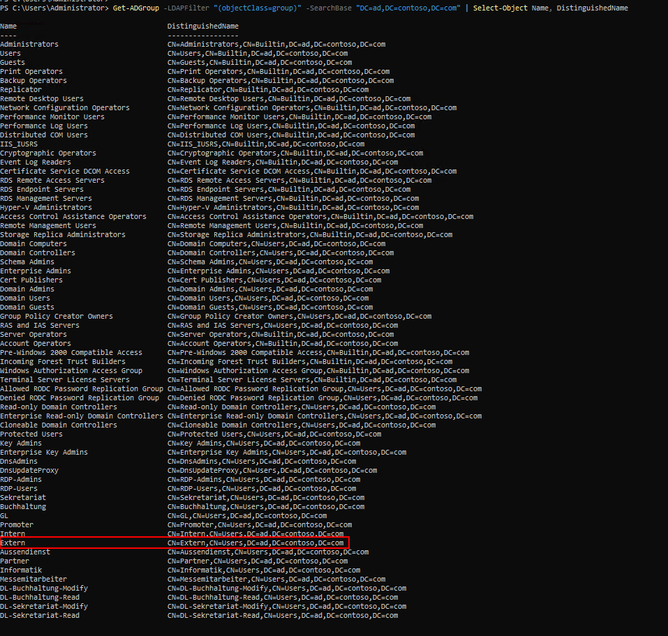
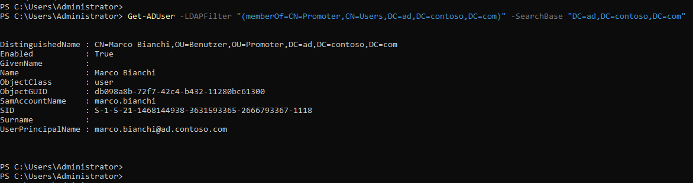
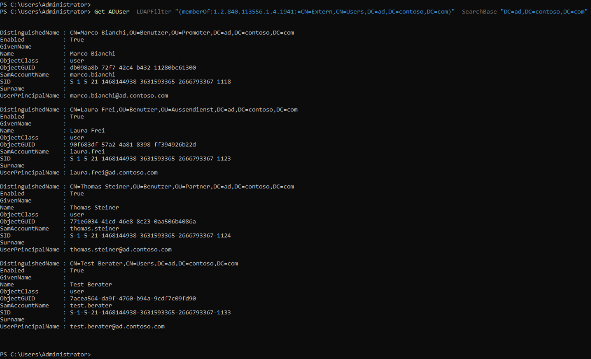
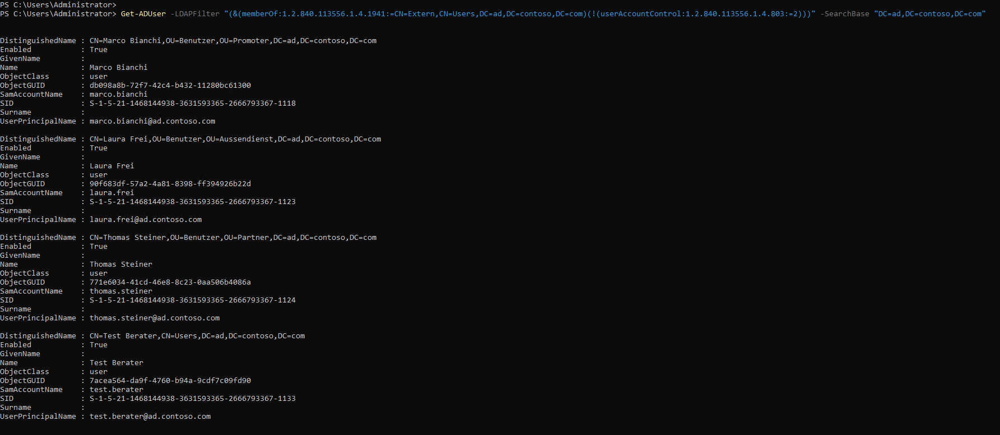
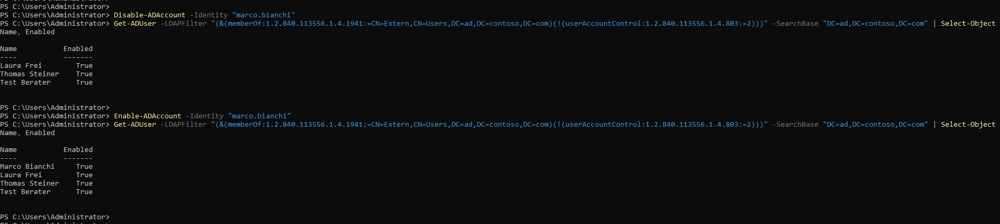
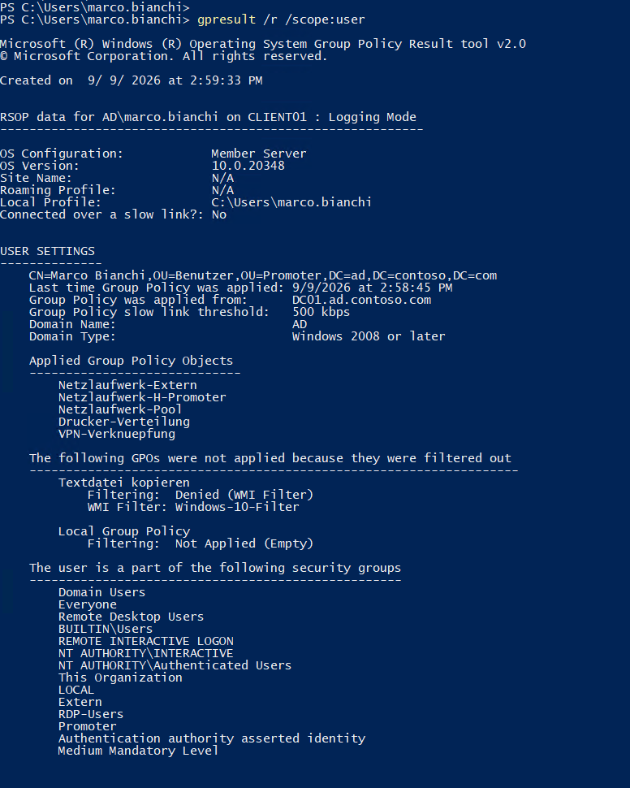

<div align="right">


</div>

<div align="center">

# Auftrag 08: Suche im Directory (LDAP)

<!--
Farblogik (Phase): offen=lightgrey · in-arbeit=d29922 (amber) · fertig=1b7f79 (teal) · Kompetenzfelder=58a6ff (blau, neutral)
-->


**[Ziel](#ziel) · [Vorgehen](#vorgehen) · [Nachweise](#nachweise) · [Checkliste](#checkliste)**

</div>

---

<h2 id="ziel"><font color="#8250df">Ziel</font></h2>

> Mit `ldp.exe` und PowerShell-LDAP-Filtern im Directory suchen, einen mehrstufigen Filter für eine Firewall-Regel entwickeln (direkte Gruppenmitgliedschaft, transitive Mitgliedschaft, aktive Konten), diesen Filter über Item-Level-Targeting in einer GPO aktivieren, und ein Firewall-Konfigurationsblatt mit begründeter Dienstkonto- und Portwahl erstellen.

<br>

<h2 id="vorgehen"><font color="#8250df">Vorgehen</font></h2>

<details open>
<summary><strong>1. Bind und Base-DN</strong></summary>

Da DC01 als Server Core ohne grafische Oberfläche läuft, wurde `ldp.exe` stattdessen auf AdminCenter01 installiert (`Install-WindowsFeature -Name RSAT-AD-Tools -IncludeAllSubFeature`) und von dort aus remote auf `dc01.ad.contoso.com` verbunden.

Verbindung über **Connection → Connect...** mit Server `dc01.ad.contoso.com`, Port `389`, ohne SSL. Der erste Bind-Versuch über "Bind as currently logged on user" schlug mit "Invalid Credentials" fehl (SSPI/Negotiate lieferte NULL-Anmeldeinformationen in dieser RDP-Sitzung), ein expliziter Bind mit Benutzername, Passwort und Domäne funktionierte zuverlässig.

Die Base-DN `DC=ad,DC=contoso,DC=com` leitet sich direkt aus dem Domänennamen `ad.contoso.com` ab: jeder Namensbestandteil zwischen den Punkten wird zu einem eigenen `DC=`-Bestandteil der Distinguished Name. Der Bind-Vorgang authentifiziert die Verbindung mit den Anmeldeinformationen eines bestimmten Kontos, erst danach dürfen Objekte im Baum gelesen werden (vor dem erfolgreichen Bind lieferte die Baumansicht nur "No children", trotz erfolgreicher reiner Netzwerkverbindung).

Im Baum navigiert zu `OU=Benutzer,OU=Promoter,DC=ad,DC=contoso,DC=com`, dort Marco Bianchi gefunden mit dem vollständigen DN:

```
CN=Marco Bianchi,OU=Benutzer,OU=Promoter,DC=ad,DC=contoso,DC=com
```



*ldp.exe nach erfolgreichem Bind, Marco Bianchi im Baum gefunden.*

</details>

<details open>
<summary><strong>2. Drei Aufwärm-Suchen</strong></summary>

**2.1 Marco Bianchi per Logon-Name**, mit beiden Werkzeugen:

```
Filter (ldp.exe): (sAMAccountName=marco.bianchi)
```

```powershell
Get-ADUser -LDAPFilter "(sAMAccountName=marco.bianchi)"
```

Beide liefern denselben Treffer mit demselben DN.



*`Get-ADUser` liefert denselben Treffer wie zuvor `ldp.exe`.*

**2.2 Alle Buchhaltungs-Benutzer, One Level vs. Subtree**:

```powershell
Get-ADUser -LDAPFilter "(objectClass=user)" -SearchBase "OU=Benutzer,OU=Buchhaltung,DC=ad,DC=contoso,DC=com" -SearchScope OneLevel
# Treffer: Peter Keller

Get-ADUser -LDAPFilter "(objectClass=user)" -SearchBase "OU=Buchhaltung,DC=ad,DC=contoso,DC=com" -SearchScope Subtree
# Treffer: Peter Keller

Get-ADUser -LDAPFilter "(objectClass=user)" -SearchBase "OU=Buchhaltung,DC=ad,DC=contoso,DC=com" -SearchScope OneLevel
# Kein Treffer
```

Der Unterschied zeigt sich deutlich: Auf der direkten ersten Ebene unter `OU=Buchhaltung` liegen nur die beiden Unter-OUs `Benutzer` und `Computer`, keine Benutzerobjekte selbst, daher liefert "One Level" auf dieser Basis keinen Treffer. "Subtree" durchsucht dagegen rekursiv alle Ebenen darunter und findet Peter Keller unabhängig von der Verschachtelungstiefe. "One Level" ist also stark abhängig von der genauen Position der Base-DN in der Hierarchie, "Subtree" nicht.



*Alle drei Suchen im Terminalverlauf: OneLevel auf Benutzer-Unter-OU (Treffer), Subtree auf Buchhaltung (Treffer), OneLevel direkt auf Buchhaltung (kein Treffer).*

**2.3 Alle Domänengruppen**, DN der Gruppe "Extern" notiert:

```powershell
Get-ADGroup -LDAPFilter "(objectClass=group)" -SearchBase "DC=ad,DC=contoso,DC=com" | Select-Object Name, DistinguishedName
```

```
CN=Extern,CN=Users,DC=ad,DC=contoso,DC=com
```



*Vollständige Gruppenliste, Zeile "Extern" mit ihrem DN markiert.*

</details>

<details open>
<summary><strong>3. Filter für die Firewall</strong></summary>

Drei aufsteigend komplexe Filter, jeweils mit Ergebniszahl:

**3.1 Direkte Mitglieder der Gruppe "Promoter"**:

```powershell
Get-ADUser -LDAPFilter "(memberOf=CN=Promoter,CN=Users,DC=ad,DC=contoso,DC=com)" -SearchBase "DC=ad,DC=contoso,DC=com"
```

Ergebnis: 1 Treffer (marco.bianchi).



*Direkte Mitgliedschaft in "Promoter": 1 Treffer.*

**3.2 Alle Mitglieder von "Extern", inklusive verschachtelter Gruppen**, über die LDAP-Vergleichsregel `LDAP_MATCHING_RULE_IN_CHAIN` (OID `1.2.840.113556.1.4.1941`), die transitive Gruppenmitgliedschaft über beliebig viele Verschachtelungsebenen auflöst:

```powershell
Get-ADUser -LDAPFilter "(memberOf:1.2.840.113556.1.4.1941:=CN=Extern,CN=Users,DC=ad,DC=contoso,DC=com)" -SearchBase "DC=ad,DC=contoso,DC=com"
```

Ergebnis (Stand nach dem unten beschriebenen Validierungstest 2): 4 Treffer (marco.bianchi, laura.frei, thomas.steiner, test.berater), obwohl keiner davon direkt Mitglied von "Extern" ist, sondern jeweils nur über ihre Abteilungsgruppe (Promoter, Aussendienst, Partner) bzw. über die Testgruppe "Externe Berater".



*Transitive Mitgliedschaft in "Extern": 4 Treffer, inklusive test.berater über zwei Verschachtelungsebenen (siehe Validierungstest 2).*

**3.3 Dasselbe, aber nur aktive Konten**, zusätzlich mit einer bitweisen UND-Vergleichsregel (OID `1.2.840.113556.1.4.803`) auf `userAccountControl`, um deaktivierte Konten (Bit `0x2`, ACCOUNTDISABLE) auszuschliessen:

```powershell
Get-ADUser -LDAPFilter "(&(memberOf:1.2.840.113556.1.4.1941:=CN=Extern,CN=Users,DC=ad,DC=contoso,DC=com)(!(userAccountControl:1.2.840.113556.1.4.803:=2)))" -SearchBase "DC=ad,DC=contoso,DC=com"
```

Ergebnis: 4 Treffer (alle aktuell aktiv).



*Kombinierter Filter (transitiv + nur aktive Konten): 4 Treffer, alle mit `Enabled: True`.*

**Validierungstests**:

Test 1, Deaktivierung: `Disable-ADAccount -Identity "marco.bianchi"` gefolgt vom erneuten Filter zeigt korrekt nur noch 3 Treffer (laura.frei, thomas.steiner, test.berater). Nach `Enable-ADAccount -Identity "marco.bianchi"` wieder 4 Treffer.



*Validierungstest 1: nach `Disable-ADAccount` fehlt marco.bianchi im Filterergebnis (3 Treffer), nach `Enable-ADAccount` ist er wieder dabei (4 Treffer).*

Test 2, neue verschachtelte Gruppe: Eine Testgruppe `Externe Berater` wurde erstellt und selbst als Mitglied zu `Extern` hinzugefügt, ein Testbenutzer `test.berater` wurde in `Externe Berater` aufgenommen:

```powershell
New-ADGroup -Name "Externe Berater" -GroupScope Global -GroupCategory Security -Path "DC=ad,DC=contoso,DC=com"
Add-ADGroupMember -Identity "Extern" -Members "Externe Berater"
New-ADUser -Name "Test Berater" -SamAccountName "test.berater" -UserPrincipalName "test.berater@ad.contoso.com" -Path "CN=Users,DC=ad,DC=contoso,DC=com" -AccountPassword (ConvertTo-SecureString "Passwort123!" -AsPlainText -Force) -Enabled $true
Add-ADGroupMember -Identity "Externe Berater" -Members "test.berater"
```

Ohne jede Filteränderung zeigte der 3.3-Filter danach 4 Treffer (siehe Screenshot oben zu 3.2/3.3), test.berater erschien korrekt trotz zweier Verschachtelungsebenen (test.berater → Externe Berater → Extern). Testgruppe und Testbenutzer bleiben bewusst als Nachweis-Setup bestehen.

**Warum der Filter auf "Extern" zielt statt direkt auf "Promoter"**: Die Firewall-Regel soll für alle extern arbeitenden Personen gelten, nicht nur für Promoter. Da die drei externen Abteilungsgruppen (Promoter, Aussendienst, Partner) bereits alle in der übergeordneten Gruppe "Extern" verschachtelt sind, deckt ein einziger Filter auf "Extern" automatisch alle aktuellen und zukünftigen externen Abteilungen ab, ohne dass die Firewall-Regel bei einer neuen externen Abteilung angepasst werden müsste.

</details>

<details open>
<summary><strong>4. Filter über GPO aktivieren</strong></summary>

Eine GPO "VPN-Verknuepfung" mit einer Desktop-Verknüpfung (User Configuration, Preferences, Windows Settings, Shortcuts) wurde erstellt, verlinkt an die gesamte Domäne. Die dafür nötige Shortcuts-Client-Side-Extension (`{CEFFA6E2-E3BD-421B-852C-6F6A79A59BC1}`) fehlte auf Client01 (bereits aus Auftrag 07 bekannt), wurde aber diesmal direkt per Registry-Eintrag nachgetragen (dieselbe Methode wie bei der Applications-CSE in Auftrag 07 Teil 6), anstatt auf ein Logon-Script auszuweichen, weil die Aufgabenstellung hier ausdrücklich ein GUI-natives Item-Level-Targeting vom Typ "LDAP Query" verlangt.

Im Targeting-Editor (Reiter Common, Item-level targeting, Targeting..., New Item, LDAP Query) wurde der Filter aus 3.3 eingetragen. Dabei trat ein hartnäckiges, aufwendig einzugrenzendes Problem auf: der Shortcut erschien bei jedem getesteten Benutzer, unabhängig vom Filterinhalt, auch bei einem absichtlich garantiert falschen Filter wie `(sAMAccountName=peter.keller)` bei anna.muster (die nicht peter.keller ist).

Zwei unabhängige Ursachen wurden dabei gefunden und behoben:

Erstens dasselbe AD-Versions-Synchronisationsproblem wie bei der Passwortrichtlinie und der Druckerverteilung in Auftrag 07: `versionNumber` in AD und `Version=` in `gpt.ini` auf SYSVOL waren nach mehreren Änderungen am Preferences-Item nicht synchron, wodurch der Client "No changes were detected" meldete und das Item nie neu auswertete. Behoben durch manuelles Angleichen beider Werte, danach zeigte das Event-Log korrekt "Changes were detected".

Zweitens, die eigentliche Ursache für die falsche Auswertung selbst: eine LDAP-Query in diesem Targeting-Editor bezieht sich nicht automatisch auf den aktuell angemeldeten Benutzer. Ein Filter wie `(sAMAccountName=peter.keller)` prüft lediglich, ob irgendwo in der Domäne ein Objekt existiert, das diesen Filter erfüllt, unabhängig davon, wer die GPO gerade verarbeitet. Die Lösung ist die Ersetzungsvariable `%LogonUser%`, die zur Laufzeit durch den Logon-Namen des aktuell verarbeitenden Benutzers ersetzt wird und explizit in den Filter eingebaut werden muss:

```
(&(sAMAccountName=%LogonUser%)(memberOf:1.2.840.113556.1.4.1941:=CN=Extern,CN=Users,DC=ad,DC=contoso,DC=com)(!(userAccountControl:1.2.840.113556.1.4.803:=2)))
```

Erst mit dieser Variable wertete das Targeting korrekt aus: Marco Bianchi (extern, aktiv) erhält den Shortcut, anna.muster (intern) nicht. Bestätigt über `gpresult /r /scope:user` bei marco.bianchi, das "VPN-Verknuepfung" korrekt unter "Applied Group Policy Objects" zeigt.



*`gpresult /r /scope:user` bei marco.bianchi, VPN-Verknuepfung korrekt unter Applied Group Policy Objects.*

</details>

<details open>
<summary><strong>5. Firewall-Konfigurationsblatt</strong></summary>

Da keine offizielle Formularvorlage vorlag, wurde ein eigenes Konfigurationsblatt basierend auf den Anforderungen der Aufgabenstellung erstellt:

| Feld | Wert |
|---|---|
| Zweck der Abfrage | Firewall-Regel für VPN-Zugang: pro Login prüfen, ob der Benutzer aktives Mitglied der Gruppe "Extern" ist |
| LDAP-Server | dc01.ad.contoso.com |
| Port / Protokoll | 636 (LDAPS) |
| Base-DN | DC=ad,DC=contoso,DC=com |
| Such-Scope | Subtree |
| Filter | `(&(sAMAccountName=%LogonUser%)(memberOf:1.2.840.113556.1.4.1941:=CN=Extern,CN=Users,DC=ad,DC=contoso,DC=com)(!(userAccountControl:1.2.840.113556.1.4.803:=2)))` |
| Dienstkonto | Dediziertes Konto `svc-firewall-ldap`, nur Leserecht auf die Attribute `sAMAccountName`, `memberOf`, `userAccountControl` |
| Berechtigungsumfang | Nur Lesezugriff auf Benutzerobjekte, kein Schreibzugriff, keine Mitgliedschaft in administrativen Gruppen |

**Begründung Dienstkonto**: Ein dediziertes, schreibgeschütztes Dienstkonto statt eines bestehenden Admin-Kontos oder anonymem Zugriff, weil anonymer LDAP-Zugriff in modernen AD-Umgebungen standardmässig deaktiviert ist und ein Sicherheitsrisiko wäre (jeder im Netzwerk könnte Verzeichnisdaten auslesen), während ein bestehendes Admin-Konto weit mehr Rechte hätte als für eine reine Mitgliedschaftsabfrage nötig, was bei einer kompromittierten Firewall-Anwendung ein unnötig grosses Schadenspotenzial böte. Das dedizierte Konto folgt dem Prinzip der geringsten Rechte, es kann bei Bedarf jederzeit ohne Nebenwirkungen deaktiviert oder eingeschränkt werden, ohne andere Dienste zu beeinträchtigen.

**Begründung Port 389 vs. 636**: Über Port 389 (Klartext-LDAP) werden bei einer einfachen Bindung (Simple Bind) Benutzername und Passwort des Dienstkontos unverschlüsselt (lediglich Base64-kodiert, nicht kryptografisch geschützt) über das Netzwerk übertragen, ebenso der komplette Inhalt der Suchanfrage und -antwort. Das ist besonders kritisch, da viele Firewall-Produkte aus Kompatibilitätsgründen Simple Bind statt Kerberos/SASL verwenden. LDAPS auf Port 636 verschlüsselt die gesamte Verbindung durchgehend per TLS, wodurch weder die Anmeldedaten des Dienstkontos noch die übertragenen Verzeichnisdaten (Gruppenzugehörigkeit, Kontostatus) von einem Angreifer im selben Netzwerksegment mitgelesen werden können. Da die Firewall diese Abfrage bei jedem VPN-Login durchführt, würde ein dauerhafter Klartextbetrieb ein unnötiges, laufendes Risiko darstellen.

**Anmeldeinformationen und Zugriffseinschränkung**: Zur Ausführung des Filters braucht die Firewall lediglich die Zugangsdaten des dedizierten Dienstkontos (Benutzername und Passwort für den LDAPS-Bind), keine weiteren Berechtigungen. Der Zugriff sollte auf das Lesen der drei genannten Attribute beschränkt werden, idealerweise zusätzlich über eine eigene, restriktive ACL direkt auf dem Dienstkonto-Objekt oder eine Firewall-Regel, die nur der Firewall-Appliance selbst den Zugriff auf Port 636 des Domänencontrollers erlaubt, nicht dem gesamten Netzwerk.

Siehe auch [entscheidungsprotokoll.md](./entscheidungsprotokoll.md) für die vollständige Abwägung der Dienstkonto-Entscheidung.

</details>

<br>

<h2 id="nachweise"><font color="#8250df">Nachweise</font></h2>

<details open>
<summary><strong>Screenshots anzeigen</strong></summary>

<br>

| Screenshot | Beschreibung |
|---|---|
| [02-teil1-ldp-bind-marco.png](./00-screenshots/02-teil1-ldp-bind-marco.png) | ldp.exe nach erfolgreichem Bind, Marco Bianchi im Baum mit vollständigem DN |
| [03-teil21-getaduser-marco.png](./00-screenshots/03-teil21-getaduser-marco.png) | PowerShell `Get-ADUser` für marco.bianchi, gleicher Treffer wie ldp.exe |
| [04-teil22-onelevel-vs-subtree.png](./00-screenshots/04-teil22-onelevel-vs-subtree.png) | OneLevel vs. Subtree, alle drei Suchen im Terminalverlauf |
| [05-teil23-alle-gruppen-extern.png](./00-screenshots/05-teil23-alle-gruppen-extern.png) | Alle Domänengruppen, "Extern" mit DN markiert |
| [06-teil31-promoter-direkt.png](./00-screenshots/06-teil31-promoter-direkt.png) | Direkte Mitglieder von "Promoter", 1 Treffer |
| [07-teil32-extern-transitiv.png](./00-screenshots/07-teil32-extern-transitiv.png) | Transitive Mitglieder von "Extern", 4 Treffer inkl. test.berater |
| [08-teil33-nur-aktive.png](./00-screenshots/08-teil33-nur-aktive.png) | Kombinierter Filter, nur aktive Konten, 4 Treffer |
| [09-validierung-disable-enable-marco.png](./00-screenshots/09-validierung-disable-enable-marco.png) | Validierungstest 1: Disable/Enable marco.bianchi mit Filterergebnis |
| [01-teil4-gpresult-vpn-marco.png](./00-screenshots/01-teil4-gpresult-vpn-marco.png) | gpresult: VPN-Verknuepfung korrekt bei marco.bianchi angewendet |

</details>

<br>

<h2 id="checkliste"><font color="#8250df">Checkliste</font></h2>

- [x] Teil 1: Bind und Base-DN
- [x] Teil 2: Drei Aufwärm-Suchen
- [x] Teil 3: Filter für die Firewall, inklusive Validierungstests
- [x] Teil 4: Filter über GPO (Item-Level-Targeting, LDAP Query) aktiviert
- [x] Teil 5: Firewall-Konfigurationsblatt ausgefüllt
- [x] Screenshots/Nachweise abgelegt (Teil 1 bis 4)
- [x] `ki-log.md` ausgefüllt
- [x] `entscheidungsprotokoll.md` ausgefüllt (Dienstkonto für Applikationsanbindung)

<br>

<h2 id="verweise"><font color="#8250df">Verweise</font></h2>

| Datei | Inhalt |
|---|---|
| [ki-log.md](./ki-log.md) | KI-Nutzung in diesem Auftrag |
| [entscheidungsprotokoll.md](./entscheidungsprotokoll.md) | Begründung des Entscheids in diesem Auftrag |
| [Auftragsstellung (Modul-Repo)](https://ch-tbz-it.gitlab.io/Stud/m159/03-auftraege/08-suche-im-directory/) | Offizielle Aufgabenstellung |
| [Fragenkatalog (Modul-Repo)](https://ch-tbz-it.gitlab.io/Stud/m159/03-auftraege/08-suche-im-directory/fragen.html) | Vorbereitung mündlicher Nachweis |

<br>

<div align="center">

⬅️ [Auftrag 07: DIT & GPOs](../07-dit-gpos/README.md) · 🏠 [Übersicht](../README.md) · ➡️ [Auftrag 09: Identity Management & PowerShell Debugging](../09-identity-mgmt-powershell/README.md)

</div>
