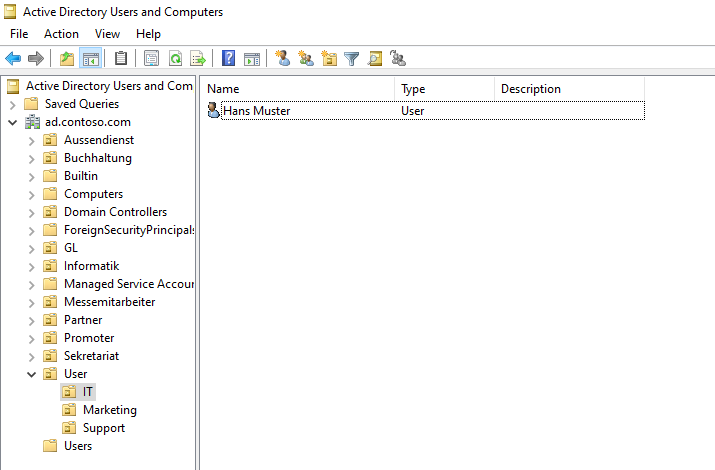
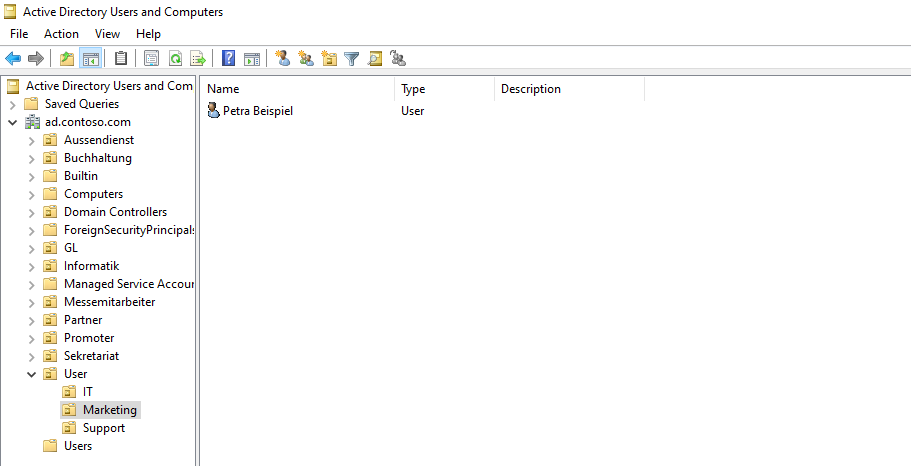
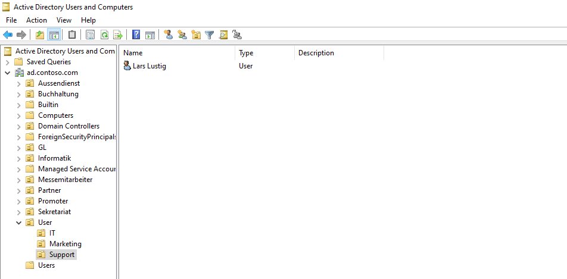

<div align="right">


</div>

<div align="center">

# Auftrag 09: Identity Management & PowerShell Debugging

<!--
Farblogik (Phase): offen=lightgrey · in-arbeit=d29922 (amber) · fertig=1b7f79 (teal) · Kompetenzfelder=58a6ff (blau, neutral)
-->


**[Ziel](#ziel) · [Umgebung](#umgebung-vorbereiten) · [Teil A](#teil-a-analyse--debugging) · [Teil B](#teil-b-funktionale-erweiterung) · [Nachweise](#nachweise) · [Checkliste](#checkliste)**

</div>

---

<h2 id="ziel"><font color="#8250df">Ziel</font></h2>

> Ein fehlerhaftes PowerShell-Skript zum automatisierten Benutzerimport aus einer CSV-Datei analysieren, alle enthaltenen Fehler identifizieren und beheben, und das Skript anschliessend um eine Vorab-Validierung erweitern, die bereits bestehende Benutzerkonten erkennt und überspringt statt sie doppelt anzulegen.

<br>

<h2 id="umgebung-vorbereiten"><font color="#8250df">Umgebung vorbereiten</font></h2>

<details open>
<summary><strong>1. OU-Struktur anlegen</strong></summary>

Laut Aufgabenstellung sollte direkt unter der Domain-Wurzel eine neue OU namens `User` entstehen, darin drei weitere OUs für die Abteilungen `IT`, `Marketing` und `Support`. Der Originaltext der Aufgabenstellung ist an dieser Stelle allerdings widersprüchlich formuliert: er nennt zuerst die neue OU `User`, spricht im selben Satzabschnitt dann aber von der OU `User-ImportUser` als Elternteil der drei Abteilungs-OUs, ohne diese Zwischenebene vorher einzuführen. Da keine zusätzliche Ebene sinnvoll aus dem übrigen Text hervorgeht, wurde entschieden, `User-ImportUser` als Tippfehler im Original zu werten und nur eine einzige OU `User` mit den drei Abteilungs-OUs direkt darunter anzulegen (Details dazu im [Entscheidungsprotokoll](./entscheidungsprotokoll.md)).

Ausgeführt auf **DC01**, angemeldet als **Administrator**:

```powershell
New-ADOrganizationalUnit -Name "User" -Path "DC=ad,DC=contoso,DC=com"
New-ADOrganizationalUnit -Name "IT" -Path "OU=User,DC=ad,DC=contoso,DC=com"
New-ADOrganizationalUnit -Name "Marketing" -Path "OU=User,DC=ad,DC=contoso,DC=com"
New-ADOrganizationalUnit -Name "Support" -Path "OU=User,DC=ad,DC=contoso,DC=com"
```

Verifiziert mit:

```powershell
Get-ADOrganizationalUnit -SearchBase "OU=User,DC=ad,DC=contoso,DC=com" -Filter * | Select-Object Name, DistinguishedName
```

Ergebnis: `User` sowie die drei Kind-OUs `IT`, `Marketing`, `Support` korrekt unterhalb der Domain-Wurzel angelegt.

</details>

<details open>
<summary><strong>2. Arbeitsverzeichnis und CSV-Datei anlegen</strong></summary>

Ebenfalls auf **DC01**, als **Administrator** (kein GUI vorhanden, da DC01 als Server Core läuft, deshalb Erstellung der CSV direkt per Here-String statt über einen Editor):

```powershell
New-Item -Path "C:\Temp" -ItemType Directory -Force

@"
Vorname,Nachname,Abteilung
Hans,Muster,IT
Petra,Beispiel,Marketing
Lars,Lustig,Support
"@ | Set-Content -Path "C:\Temp\mitarbeiter.csv" -Encoding UTF8
```

Verifiziert mit `Get-Content "C:\Temp\mitarbeiter.csv"`, Inhalt entspricht exakt der Vorgabe aus der Aufgabenstellung (Komma-getrennt, drei Beispieldatensätze).

</details>

<br>

<h2 id="teil-a-analyse--debugging"><font color="#8250df">Teil A: Analyse & Debugging</font></h2>

Das vorgegebene Skript `import-users.ps1` enthielt fünf Fehler, die den Import vollständig verhindert hätten. Jeder Fehler wurde einzeln identifiziert, begründet und behoben, bevor das Skript zum ersten Mal ausgeführt wurde (siehe auch [error-log.md](./error-log.md) für die tabellarische Kurzfassung).

<details open>
<summary><strong>Fehler 1: Falsches Trennzeichen beim CSV-Import</strong></summary>

Das Original verwendete `Import-CSV $csvPath -Delimiter ";"`, obwohl die vorgegebene CSV mit Kommas getrennt ist. Mit dem falschen Trennzeichen hätte PowerShell jede Zeile als einzige Spalte eingelesen, wodurch `$row.Vorname` den kompletten Zeileninhalt statt nur den Vornamen enthalten hätte. Behoben durch `-Delimiter ","`.

</details>

<details open>
<summary><strong>Fehler 2: Fehlende Sub-Expression bei der String-Interpolation</strong></summary>

An mehreren Stellen wurde eine Objekteigenschaft direkt in einem String referenziert, z. B. `"$row.Vorname $row.Nachname"`. PowerShell interpoliert in doppelten Anführungszeichen nur die Variable `$row` selbst, gibt deren Standard-Textdarstellung aus und hängt den Rest (`.Vorname`) als reinen Text an, statt auf die Eigenschaft zuzugreifen. Behoben durch die Sub-Expression-Syntax `$($row.Vorname)` überall dort, wo eine Objekteigenschaft innerhalb eines Strings gebraucht wird.

</details>

<details open>
<summary><strong>Fehler 3: Distinguished Name entspricht nicht der echten Domäne</strong></summary>

Das Original verwendete durchgehend `DC=it-tbz,DC=local`, was nicht der tatsächlichen Umgebung entspricht. Alle DN-Angaben wurden auf die reale Domäne `DC=ad,DC=contoso,DC=com` angepasst, ebenso der UPN-Suffix (`@ad.contoso.com` statt `@it-tbz.local`).

</details>

<details open>
<summary><strong>Fehler 4: Falsches Cmdlet für die Passwort-Konvertierung</strong></summary>

Das Original rief `ConvertFrom-SecureString "Schule123" -AsPlainText -Force` auf. `ConvertFrom-SecureString` erwartet als Eingabe bereits einen SecureString und wandelt ihn in eine verschlüsselte Textdarstellung zur Speicherung um, das genaue Gegenteil dessen, was hier gebraucht wird. Für `-AccountPassword` bei `New-ADUser` wird umgekehrt ein SecureString benötigt, der aus einem Klartext-Passwort erzeugt wird. Behoben durch `ConvertTo-SecureString "Schule123" -AsPlainText -Force`.

</details>

<details open>
<summary><strong>Fehler 5: Fehlerhafte OU-Pfad-Logik</strong></summary>

`$targetOU = "OU=$row.Abteilung,OU=User,DC=it-tbz,DC=local"` litt gleich unter zwei Problemen: derselben fehlenden Sub-Expression wie in Fehler 2 (`$row.Abteilung` statt `$($row.Abteilung)`), und der falschen Domäne aus Fehler 3. Nach Behebung beider Teilprobleme ergibt sich pro Zeile korrekt z. B. `OU=IT,OU=User,DC=ad,DC=contoso,DC=com`.

</details>

<br>

<h2 id="teil-b-funktionale-erweiterung"><font color="#8250df">Teil B: Funktionale Erweiterung</font></h2>

Vor dem eigentlichen `New-ADUser`-Aufruf prüft das Skript nun mit `Get-ADUser -Filter "SamAccountName -eq '$sAMAccountName'"`, ob der jeweilige Benutzername bereits existiert. Existiert er, wird eine gelbe Warnmeldung ausgegeben und der Eintrag übersprungen, statt einen Fehler zu erzeugen oder ein Duplikat anzulegen. Existiert er nicht, wird der Benutzer wie gewohnt erstellt und danach eine grüne Erfolgsmeldung ausgegeben.

```powershell
$existingUser = Get-ADUser -Filter "SamAccountName -eq '$sAMAccountName'" -ErrorAction SilentlyContinue

if ($existingUser) {
    Write-Host "User $sAMAccountName existiert bereits - wird uebersprungen." -ForegroundColor Yellow
}
else {
    New-ADUser -Name "$($row.Vorname) $($row.Nachname)" `
               -SamAccountName $sAMAccountName `
               -UserPrincipalName $userPrincipalName `
               -Path $targetOU `
               -AccountPassword (ConvertTo-SecureString "Schule123" -AsPlainText -Force) `
               -Enabled $true

    Write-Host "User $sAMAccountName erfolgreich erstellt." -ForegroundColor Green
}
```

**Test 1 (Erstlauf):** Alle drei Benutzer aus der CSV wurden ohne Fehler angelegt, jeweils mit grüner Erfolgsmeldung.



*OU `IT` mit dem angelegten Benutzer Hans Muster.*



*OU `Marketing` mit der angelegten Benutzerin Petra Beispiel.*



*OU `Support` mit dem angelegten Benutzer Lars Lustig.*

**Test 2 (Zweitlauf):** Beim erneuten Ausführen desselben Skripts mit derselben CSV wurden alle drei Benutzer korrekt als bereits existierend erkannt, jeweils mit gelber Warnmeldung, und kein Duplikat wurde angelegt. Damit ist die Idempotenz des Skripts bestätigt.

Das vollständige korrigierte Skript liegt unter [`import-users-korrigiert.ps1`](./import-users-korrigiert.ps1).

<br>

<h2 id="nachweise"><font color="#8250df">Nachweise</font></h2>

<details open>
<summary><strong>Screenshots anzeigen</strong></summary>

<br>

| Screenshot | Beschreibung |
|---|---|
| [01-adusers-it.png](./00-screenshots/01-adusers-it.png) | Active Directory-Benutzer und -Computer, OU `IT` mit dem angelegten Benutzer `Hans Muster` |
| [02-adusers-marketing.png](./00-screenshots/02-adusers-marketing.png) | Active Directory-Benutzer und -Computer, OU `Marketing` mit dem angelegten Benutzer `Petra Beispiel` |
| [03-adusers-support.png](./00-screenshots/03-adusers-support.png) | Active Directory-Benutzer und -Computer, OU `Support` mit dem angelegten Benutzer `Lars Lustig` |

</details>

<br>

<h2 id="checkliste"><font color="#8250df">Checkliste</font></h2>

- [x] Auftrag gestartet
- [x] OU-Struktur und CSV-Testdaten angelegt
- [x] Teil A: alle fünf Fehler identifiziert und behoben
- [x] Teil B: Vorab-Validierung ergänzt und mit Zweitlauf getestet
- [x] Umsetzung abgeschlossen
- [x] Screenshots/Nachweise abgelegt
- [x] `ki-log.md` ausgefüllt
- [x] `entscheidungsprotokoll.md` ausgefüllt (OU-Namenskonflikt in der Aufgabenstellung)

<br>

<h2 id="verweise"><font color="#8250df">Verweise</font></h2>

| Datei | Inhalt |
|---|---|
| [error-log.md](./error-log.md) | Tabellarischer Fehlerbericht zu Teil A |
| [import-users-korrigiert.ps1](./import-users-korrigiert.ps1) | Vollständiges, korrigiertes und erweitertes Skript |
| [entscheidungsprotokoll.md](./entscheidungsprotokoll.md) | Begründung zum OU-Namenskonflikt in der Aufgabenstellung |
| [ki-log.md](./ki-log.md) | KI-Nutzung in diesem Auftrag |
| [Auftragsstellung (Modul-Repo)](https://ch-tbz-it.gitlab.io/Stud/m159/03-auftraege/09-automation-und-debugging/) | Offizielle Aufgabenstellung |
| [Fragenkatalog (Modul-Repo)](https://ch-tbz-it.gitlab.io/Stud/m159/03-auftraege/09-automation-und-debugging/fragen.html) | Vorbereitung mündlicher Nachweis |

<br>

<div align="center">

⬅️ [Auftrag 08: Suche im Directory (LDAP)](../08-suche-im-directory/README.md) · 🏠 [Übersicht](../README.md) · ➡️ [Auftrag 10: MS Entra ID & MS Entra Connect](../10-entra-connect/README.md)

</div>
