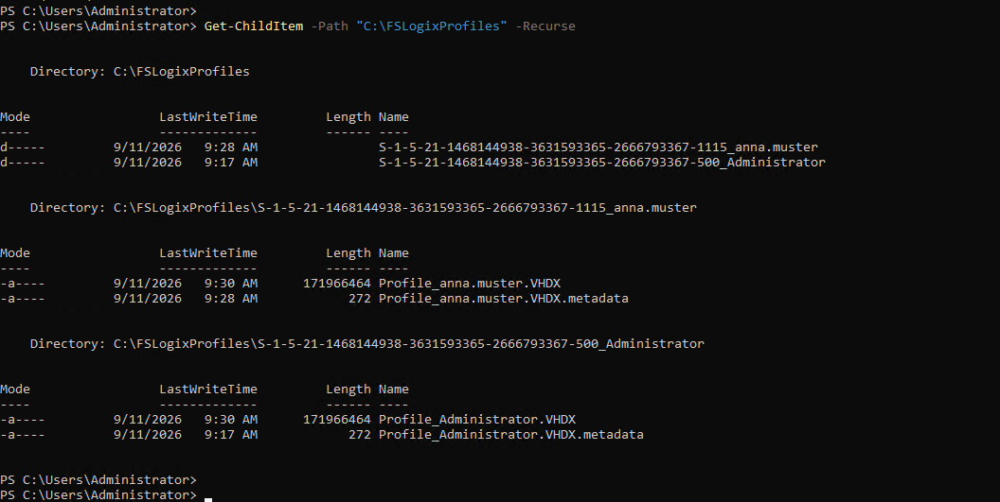
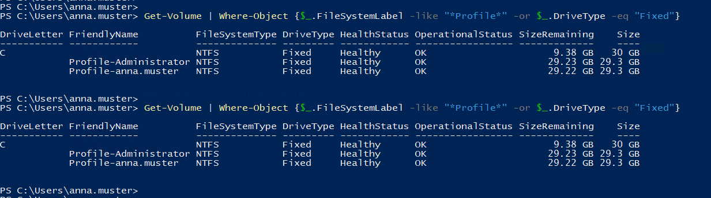

<div align="right">


</div>

<div align="center">

# Auftrag 11: Servergespeicherte Benutzerprofile

<!--
Farblogik (Phase): offen=lightgrey · in-arbeit=d29922 (amber) · fertig=1b7f79 (teal) · Kompetenzfelder=58a6ff (blau, neutral)
-->


**[Ziel](#ziel) · [Wahl der Variante](#wahl-der-variante) · [Umsetzung](#umsetzung) · [Nachweise](#nachweise) · [Checkliste](#checkliste)**

</div>

---

<h2 id="ziel"><font color="#8250df">Ziel</font></h2>

> Servergespeicherte Benutzerprofile einrichten, damit Benutzerdaten unabhängig vom jeweiligen Client verfügbar sind, statt nur lokal auf einem einzelnen PC gespeichert zu werden.

<br>

<h2 id="wahl-der-variante"><font color="#8250df">Wahl der Variante</font></h2>

Die Aufgabenstellung bietet zwei Varianten an: FSLogix Profile Container (rein On-Premises) und OneDrive Known Folder Move (KFM), das einen aktiven Azure for Students Tenant mit Entra ID und Azure AD Connect voraussetzt. Die offizielle Aufgabenstellung enthält dazu einen ausdrücklichen Hinweis:

> "OneDrive kann im Moment nicht als zentraler Profilspeicher verwendet werden. Sie erhalten die volle Punktzahl (Stufe 3) für die FS-Logix Aufgabe."

Das ist keine freie Wahl zwischen zwei gleichwertigen Optionen, sondern eine Vorgabe der Aufgabenstellung selbst. Umgesetzt wurde deshalb ausschliesslich **FSLogix Profile Container**, unabhängig vom Azure-Tenant aus Auftrag 10 und dessen aktuellem Blocker (siehe [Auftrag 10](../10-entra-connect/README.md)).

<br>

<h2 id="umsetzung"><font color="#8250df">Umsetzung</font></h2>

<details open>
<summary><strong>1. Freigabe und Berechtigungen</strong></summary>

Ausgeführt auf **DC01**, angemeldet als **Administrator**:

```powershell
New-Item -Path "C:\FSLogixProfiles" -ItemType Directory
New-SmbShare -Name "FSLogixProfiles" -Path "C:\FSLogixProfiles" -FullAccess "Everyone"
```

Die Freigabeberechtigung "Everyone" wird direkt anschliessend über NTFS eingeschränkt, analog zur Software-Freigabe aus [Auftrag 07](../07-dit-gpos/README.md):

```powershell
$path = "C:\FSLogixProfiles"
icacls $path /grant "SYSTEM:(OI)(CI)F"
icacls $path /grant "Administrators:(OI)(CI)F"
icacls $path /grant "Creator Owner:(OI)(CI)(IO)F"
icacls $path /grant "AD\FSLogix-Users:(RX,AD,WD)"
icacls $path /remove "Everyone"
icacls $path /remove "Users"
```

Damit haben nur SYSTEM, Administrators und die eigens erstellte Gruppe `FSLogix-Users` Zugriff, nicht mehr Jeder.

</details>

<details open>
<summary><strong>2. AD-Gruppe und Testbenutzer</strong></summary>

Eine eigene Gruppe statt der Standardgruppe "Jeder", wie von der FSLogix-Dokumentation empfohlen:

```powershell
New-ADGroup -Name "FSLogix-Users" -GroupScope Global -GroupCategory Security -Path "CN=Users,DC=ad,DC=contoso,DC=com"
Add-ADGroupMember -Identity "FSLogix-Users" -Members "anna.muster","peter.keller"
```

Verwendet wurden zwei bereits bestehende Testbenutzer aus [Auftrag 04](../04-freigaben-berechtigungen/README.md).

</details>

<details open>
<summary><strong>3. FSLogix-Installation</strong></summary>

FSLogix wurde von der offiziellen Microsoft-Quelle heruntergeladen, über die zentrale Software-Freigabe verteilt und auf **Client01** installiert:

```powershell
Start-Process -FilePath "C:\Temp\FSLogixAppsSetup.exe" -ArgumentList "/install /quiet /norestart" -Wait
```

Verifiziert über die beiden FSLogix-Dienste:

```powershell
Get-Service -Name "frxsvc","frxccds"
```

Beide Dienste (`FSLogix Apps Services`, `FSLogix Cloud Caching Service`) liefen nach der Installation korrekt im Status `Running`.

</details>

<details open>
<summary><strong>4. GPO-Konfiguration</strong></summary>

Die FSLogix-ADMX/ADML-Vorlagen wurden in den zentralen SYSVOL-Store kopiert, damit sie im Group Policy Management Editor domänenweit sichtbar sind:

```powershell
Copy-Item -Path "C:\Daten\Software\FSLogix\fslogix.admx" -Destination "C:\Windows\SYSVOL\sysvol\ad.contoso.com\Policies\PolicyDefinitions\fslogix.admx"
Copy-Item -Path "C:\Daten\Software\FSLogix\fslogix.adml" -Destination "C:\Windows\SYSVOL\sysvol\ad.contoso.com\Policies\PolicyDefinitions\en-US\fslogix.adml"
```

Eine neue GPO `FSLogix-ProfileContainers` wurde unter **Computer Configuration → Administrative Templates → FSLogix → Profile Containers** mit folgenden Einstellungen konfiguriert:

| Einstellung | Wert |
|---|---|
| Enabled | Enabled |
| VHD Locations | `\\dc01.ad.contoso.com\FSLogixProfiles` |
| Delete Local Profile When VHD Should Apply | Enabled |
| Volume Type (VHD or VHDX) | VHDX |

Die GPO wurde mit der Domäne verknüpft. Wichtiger technischer Befund: da es sich um eine **Computer**-Configuration-Einstellung handelt, muss die Security-Filterung ein **Computerkonto** oder `Authenticated Users` berechtigen, nicht eine Benutzergruppe. Ein erster Versuch mit `FSLogix-Users` (einer reinen Benutzergruppe) als Security-Filter führte dazu, dass `gpresult /r /scope computer` die GPO gar nicht erst als angewendet auflistete, da das Computerkonto `CLIENT01$` selbst kein Mitglied dieser Gruppe ist. Nach Umstellung der Security-Filterung auf `Authenticated Users` wurde die GPO korrekt angewendet, die tatsächliche Einschränkung auf bestimmte Benutzer übernimmt FSLogix intern über die Gruppe `FSLogix Profile Include List`.

Verifiziert nach `gpupdate /force` und Neustart von Client01:

```powershell
gpresult /r /scope computer
Get-ItemProperty -Path "HKLM:\SOFTWARE\FSLogix\Profiles"
```

`FSLogix-ProfileContainers` erscheint korrekt unter "Applied Group Policy Objects", und die Registry zeigt alle vier Einstellungen exakt wie konfiguriert.

</details>

<details open>
<summary><strong>5. Test und Verifikation</strong></summary>

Nach An- und Abmeldung von **anna.muster** auf **Client01** wurde auf **DC01** geprüft, ob ein FSLogix-Profil-Container erstellt wurde:

```powershell
Get-ChildItem -Path "C:\FSLogixProfiles" -Recurse
```



*Für `anna.muster` und `Administrator` wurde je eine `Profile_<Benutzername>.VHDX` in der Freigabe `FSLogixProfiles` erstellt.*

Zusätzlich wurde auf **Client01**, während `anna.muster` angemeldet ist, geprüft, ob der Container tatsächlich als Volume gemountet ist (nicht nur die VHDX-Datei existiert):

```powershell
Get-Volume | Where-Object {$_.FileSystemLabel -like "*Profile*" -or $_.DriveType -eq "Fixed"}
```



*Das Volume `Profile-anna.muster` ist korrekt gemountet (Healthy, 29.3 GB), neben `Profile-Administrator`.*

Damit ist bestätigt, dass FSLogix das Benutzerprofil tatsächlich als eigenständigen, servergespeicherten Container verwaltet, nicht nur eine Datei ablegt.

</details>

<br>

<h2 id="nachweise"><font color="#8250df">Nachweise</font></h2>

<details open>
<summary><strong>Screenshots anzeigen</strong></summary>

<br>

| Screenshot | Beschreibung |
|---|---|
| [01-fslogix-vhdx-erstellt.png](./00-screenshots/01-fslogix-vhdx-erstellt.png) | Erstellte VHDX-Profil-Container für `anna.muster` und `Administrator` in der Freigabe `FSLogixProfiles` |
| [02-fslogix-volume-gemountet.png](./00-screenshots/02-fslogix-volume-gemountet.png) | Gemountetes Volume `Profile-anna.muster` (Healthy, 29.3 GB) |

</details>

<br>

<h2 id="checkliste"><font color="#8250df">Checkliste</font></h2>

- [x] Auftrag gestartet
- [x] Wahl der Variante begründet (FSLogix statt OneDrive-KFM, siehe oben)
- [x] Freigabe und NTFS-Berechtigungen eingerichtet
- [x] AD-Gruppe und Testbenutzer angelegt
- [x] FSLogix installiert und Dienste verifiziert
- [x] GPO konfiguriert und domänenweit verknüpft
- [x] Umsetzung abgeschlossen
- [x] Screenshots/Nachweise abgelegt
- [x] `ki-log.md` ausgefüllt

<br>

<h2 id="verweise"><font color="#8250df">Verweise</font></h2>

| Datei | Inhalt |
|---|---|
| [ki-log.md](./ki-log.md) | KI-Nutzung in diesem Auftrag |
| [Auftragsstellung (Modul-Repo)](https://ch-tbz-it.gitlab.io/Stud/m159/03-auftraege/11-servergespeicherte-benutzerprofile/) | Offizielle Aufgabenstellung |
| [Fragenkatalog (Modul-Repo)](https://ch-tbz-it.gitlab.io/Stud/m159/03-auftraege/11-servergespeicherte-benutzerprofile/fragen.html) | Vorbereitung mündlicher Nachweis |

<br>

<div align="center">

⬅️ [Auftrag 10: MS Entra ID & MS Entra Connect](../10-entra-connect/README.md) · 🏠 [Übersicht](../README.md) · ➡️ [Auftrag 12: Netzlaufwerk to Azure Migration](../12-netzlaufwerk-azure/README.md)

</div>
