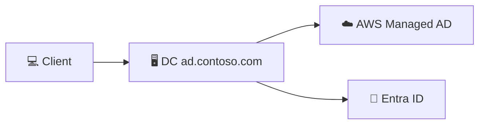
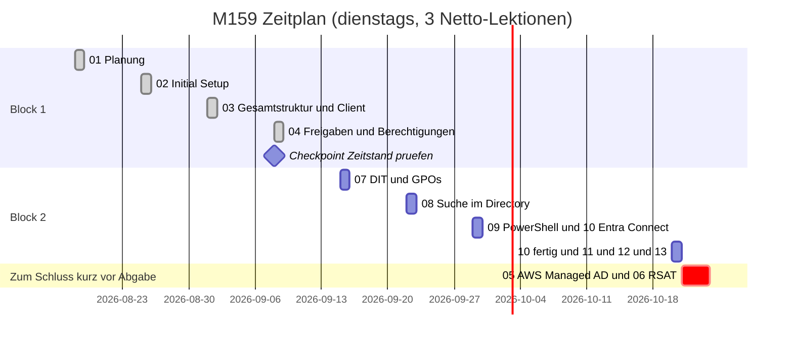

<picture>
  <source media="(prefers-color-scheme: dark)" srcset="https://tbz.ch/wp-content/uploads/2026/04/TBZ-Logo-invertiert.svg">
  
</picture>

# 🗂️ M159: Directoryservices | Projekt Contoso

**[Zeitplan](#zeitplan) · [Aufträge](#aufträge-übersicht) · [Architektur](./01-planung/README.md#architektur) · [Setup-Sheet](./01-planung/setup-sheet.md) · [KI-Nutzung](https://ch-tbz-it.gitlab.io/Stud/m159/ki-nutzung.html)**

---

 

## Kurzüberblick

Aufbau einer Active-Directory-Umgebung (Contoso) auf AWS EC2, Integration mit AWS Managed Microsoft AD und Anbindung an Microsoft Entra ID.

| Technologie | Einsatz |
|---|---|
|  | Cloud-Hosting der gesamten AD-Umgebung |
|  | Automatisierung, AD-/DNS-/NTFS-Verwaltung |
|  | Domain Services, Gruppen, Berechtigungen, GPOs |
|  | Cloud-Identity, Sync via Entra Connect |
|  | Versionierung, Dokumentation |

| | |
|---|---|
| 🌐 Second-Level-Domäne | [`contoso.com`](./01-planung/README.md) |
| 🏢 On-Prem AD | [`ad.contoso.com`](./03-gesamtstruktur-dc-client/README.md) |
| ☁️ AWS Managed AD | [`aws.contoso.com`](./05-aws-managed-ad/README.md) |
| 🔑 Öffentlicher UPN | `contoso-robin.dynv6.net` |
| 📋 Details | [Setup-Sheet](./01-planung/setup-sheet.md) |

<picture>
  <source media="(prefers-color-scheme: dark)" srcset="https://quickchart.io/chart?c=%7B%22type%22%3A%22pie%22%2C%22data%22%3A%7B%22labels%22%3A%5B%22Erledigt%20%284%29%22%2C%22Offen%20%289%29%22%5D%2C%22datasets%22%3A%5B%7B%22data%22%3A%5B4%2C9%5D%2C%22backgroundColor%22%3A%5B%22%232ea44f%22%2C%22%238b949e%22%5D%7D%5D%7D%2C%22options%22%3A%7B%22plugins%22%3A%7B%22title%22%3A%7B%22display%22%3Atrue%2C%22text%22%3A%22Auftr%C3%A4ge-Status%20%2813%20total%29%22%2C%22color%22%3A%22%23c9d1d9%22%2C%22font%22%3A%7B%22size%22%3A18%7D%7D%2C%22legend%22%3A%7B%22display%22%3Atrue%2C%22position%22%3A%22right%22%2C%22labels%22%3A%7B%22color%22%3A%22%23c9d1d9%22%2C%22font%22%3A%7B%22size%22%3A14%7D%7D%7D%7D%7D%7D&width=480&height=280&backgroundColor=transparent&format=png&version=4">
  
</picture>

 

## Zeitplan

> ⚠️ AWS Managed AD (Auftrag 05) kostet ca. 18 Dollar pro Woche. Deshalb liegen 05 und 06 bewusst nicht in der Mitte, sondern kompakt am Ende, direkt hintereinander, Managed AD wird erst kurz davor erstellt und sofort danach wieder gelöscht. 05/06 sind laut Modul die einzigen Aufträge, die verschoben werden dürfen.

Als Tabelle anzeigen

 

| # | Datum | Auftrag | Status |
|---|---|---|---|
| 1 | Di, 18.08.2026 | [01: Planung](./01-planung/README.md) | ✅ erledigt |
| 2 | Di, 25.08.2026 | [02: Initial Setup](./02-initial-setup/README.md) | ✅ erledigt |
| 3 | Di, 01.09.2026 | [03: Gesamtstruktur (1. DC) & Client](./03-gesamtstruktur-dc-client/README.md) | ✅ erledigt |
| 4 | Di, 08.09.2026 | [04: Freigaben/Berechtigungen](./04-freigaben-berechtigungen/README.md) | ✅ erledigt |
| n/a | n/a | **Checkpoint: Zeitstand prüfen** | n/a |
| 5 | Di, 15.09.2026 | [07: DIT & GPOs](./07-dit-gpos/README.md) | ⬜ offen |
| 6 | Di, 22.09.2026 | [08: Suche im Directory](./08-suche-im-directory/README.md) | ⬜ offen |
| 7 | Di, 29.09.2026 | [09: PowerShell-Debugging](./09-identity-mgmt-powershell/README.md) + [10: Entra Connect (Start)](./10-entra-connect/README.md) | ⬜ offen |
| 8 | Di, 20.10.2026 | 10 fertig + [11](./11-benutzerprofil/README.md)/[12](./12-netzlaufwerk-azure/README.md)/[13](./13-sso-python-app/README.md) (Rest ggf. Selbstarbeit) | ⬜ offen |
| n/a | kurz vor Schlussbesprechung | [05: AWS Managed AD](./05-aws-managed-ad/README.md) + [06: RSAT & Admin Center](./06-rsat-admin-center/README.md), kompakt an 1 bis 2 Tagen, danach Managed AD sofort löschen | ⬜ offen |

 

## Aufträge: Übersicht

### Block 1: Lokale Umgebung

| # | Auftrag | Status | Modul-Auftrag |
|---|---|---|---|
| [01](./01-planung/README.md) | Planung | ✅ erledigt | [↗](https://ch-tbz-it.gitlab.io/Stud/m159/03-auftraege/01-planung/) |
| [02](./02-initial-setup/README.md) | Initial Setup | ✅ erledigt | [↗](https://ch-tbz-it.gitlab.io/Stud/m159/03-auftraege/02-initial-setup/) |
| [03](./03-gesamtstruktur-dc-client/README.md) | Gesamtstruktur (1. DC) & Client | ✅ erledigt | [↗](https://ch-tbz-it.gitlab.io/Stud/m159/03-auftraege/03-neue-gesamtstruktur-und-client/) |
| [04](./04-freigaben-berechtigungen/README.md) | Freigaben, Laufwerke, Berechtigungen | ✅ erledigt | [↗](https://ch-tbz-it.gitlab.io/Stud/m159/03-auftraege/04-freigaben-laufwerke-berechtigungen/) |
| [05](./05-aws-managed-ad/README.md) | AWS Managed Microsoft AD | ⬜ ans Ende verschoben (Kosten) | [↗](https://ch-tbz-it.gitlab.io/Stud/m159/03-auftraege/05-aws-managed-microsoft-ad/) |
| [06](./06-rsat-admin-center/README.md) | RSAT & Admin Center V2 | ⬜ ans Ende verschoben (Kosten) | [↗](https://ch-tbz-it.gitlab.io/Stud/m159/03-auftraege/06-rsat-admin-center-v2/) |
| [07](./07-dit-gpos/README.md) | DIT & GPOs | ⬜ offen | [↗](https://ch-tbz-it.gitlab.io/Stud/m159/03-auftraege/07-dit-gpos/) |
| [08](./08-suche-im-directory/README.md) | Suche im Directory (LDAP) | ⬜ offen | [↗](https://ch-tbz-it.gitlab.io/Stud/m159/03-auftraege/08-suche-im-directory/) |
| [09](./09-identity-mgmt-powershell/README.md) | Identity Management & PowerShell Debugging | ⬜ offen | [↗](https://ch-tbz-it.gitlab.io/Stud/m159/03-auftraege/09-automation-und-debugging/) |

### Block 2: Cloud-Integration

| # | Auftrag | Status | Modul-Auftrag |
|---|---|---|---|
| [10](./10-entra-connect/README.md) | MS Entra ID & MS Entra Connect | ⬜ offen | [↗](https://ch-tbz-it.gitlab.io/Stud/m159/03-auftraege/10-ms-entra-id-ms-entra-connect/) |
| [11](./11-benutzerprofil/README.md) | Servergespeicherte Benutzerprofile | ⬜ offen | [↗](https://ch-tbz-it.gitlab.io/Stud/m159/03-auftraege/11-servergespeicherte-benutzerprofile/) |
| [12](./12-netzlaufwerk-azure/README.md) | Netzlaufwerk to Azure Migration | ⬜ offen | [↗](https://ch-tbz-it.gitlab.io/Stud/m159/03-auftraege/12-netzlaufwerk-to-azure-migration/) |
| [13](./13-sso-python-app/README.md) | SSO Python App | ⬜ offen | [↗](https://ch-tbz-it.gitlab.io/Stud/m159/03-auftraege/13-sso-python-app/) |

 

## Weitere Ordner

| Ordner | Inhalt |
|---|---|
| [`00-files/`](./00-files/) | Allgemeine Unterlagen (Modul-PDFs, Notizen, Sonstiges) |
| [`kompetenznachweis/`](./kompetenznachweis/) | Vorbereitung mündlicher Nachweis, Gesamt-Reflexion |

 

## KI-Nutzung

Der KI-Einsatz in diesem Projekt folgt dem verbindlichen Rahmen aus [`ki-nutzung.md`](https://ch-tbz-it.gitlab.io/Stud/m159/ki-nutzung.html) des Modul-Repositories. Wie KI konkret in diesem Projekt eingesetzt wird (Dokumentation, Diagramme, Status-Updates, Anleitungen, Screenshots), steht in [ki-einsatz.md](./ki-einsatz.md). Pro Auftrag mit KI-Anteil liegt zusätzlich ein `ki-log.md` mit Prompt, Verifikation und Reflexion vor, siehe zum Beispiel [01-planung/ki-log.md](./01-planung/ki-log.md).

 

⬆️ [Nach oben](#-m159-directoryservices--projekt-contoso) · ➡️ [Weiter zu Auftrag 01](./01-planung/README.md)

