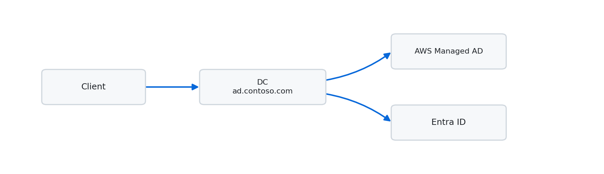
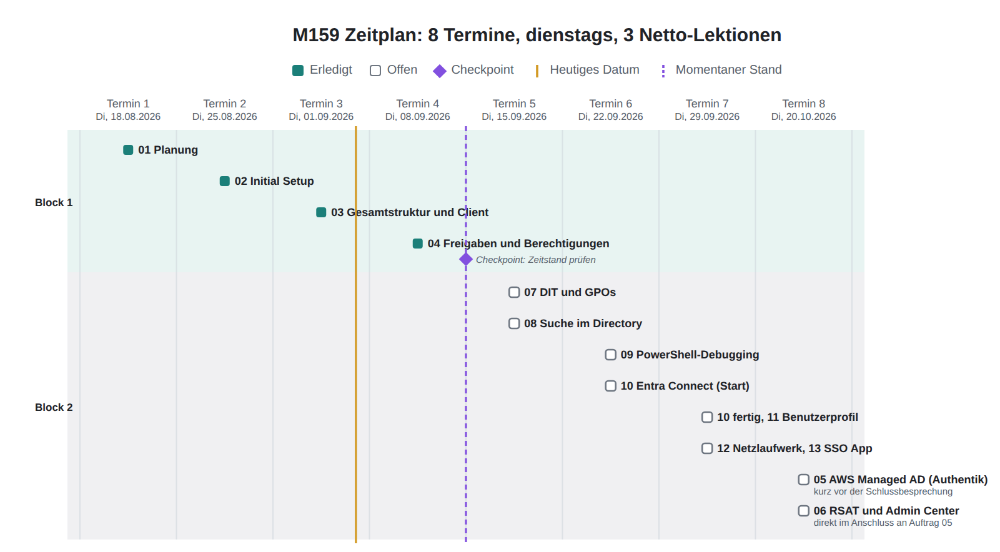

# M159: Directoryservices | Projekt Contoso

**[Zeitplan](#zeitplan) · [Aufträge](#aufträge-übersicht) · [Architektur](./01-planung/README.md#architektur) · [Setup-Sheet](./01-planung/setup-sheet.md) · [KI-Nutzung](https://ch-tbz-it.gitlab.io/Stud/m159/ki-nutzung.html)**

<picture>
  <source media="(prefers-color-scheme: dark)" srcset="./00-files/assets/banner-dark.png">
  
</picture>

 

<h2 id="kurzüberblick">Kurzüberblick</h2>

Aufbau einer Active-Directory-Umgebung (Contoso) auf AWS EC2, Integration mit AWS Managed Microsoft AD und Anbindung an Microsoft Entra ID.

<table>
<tr>
<td valign="top" width="55%">

| | |
|---|---|
| 🌐 Second-Level-Domäne | [`contoso.com`](./01-planung/README.md) |
| 🏢 On-Prem AD | [`ad.contoso.com`](./03-gesamtstruktur-dc-client/README.md) |
| ☁️ AWS Managed AD | [`aws.contoso.com`](./05-aws-managed-ad/README.md) |
| 🔑 Öffentlicher UPN | `contoso-robin.dynv6.net` |
| 📋 Details | [Setup-Sheet](./01-planung/setup-sheet.md) |

</td>
<td valign="top" width="45%" align="center">

<picture>
  <source media="(prefers-color-scheme: dark)" srcset="https://quickchart.io/chart?c=%7B%22type%22%3A%22pie%22%2C%22data%22%3A%7B%22labels%22%3A%5B%22Erledigt%20%284%29%22%2C%22Offen%20%289%29%22%5D%2C%22datasets%22%3A%5B%7B%22data%22%3A%5B4%2C9%5D%2C%22backgroundColor%22%3A%5B%22%231b7f79%22%2C%22%236e7681%22%5D%7D%5D%7D%2C%22options%22%3A%7B%22plugins%22%3A%7B%22title%22%3A%7B%22display%22%3Atrue%2C%22text%22%3A%22Auftr%C3%A4ge-Status%20%2813%20total%29%22%2C%22color%22%3A%22%23c9d1d9%22%2C%22font%22%3A%7B%22size%22%3A18%7D%7D%2C%22legend%22%3A%7B%22display%22%3Atrue%2C%22position%22%3A%22right%22%2C%22labels%22%3A%7B%22color%22%3A%22%23c9d1d9%22%2C%22font%22%3A%7B%22size%22%3A14%7D%7D%7D%7D%7D%7D&width=380&height=220&backgroundColor=transparent&format=png&version=4">
  
</picture>

</td>
</tr>
</table>

 

<h2 id="zeitplan">Zeitplan</h2>

<picture>
  <source media="(prefers-color-scheme: dark)" srcset="./00-files/assets/zeitplan-dark.png">
  
</picture>

Als Tabelle anzeigen

 

| # | Datum | Auftrag | Status |
|---|---|---|---|
| 1 | Di, 18.08.2026 | [01: Planung](./01-planung/README.md) | ✅ erledigt |
| 2 | Di, 25.08.2026 | [02: Initial Setup](./02-initial-setup/README.md) | ✅ erledigt |
| 3 | Di, 01.09.2026 | [03: Gesamtstruktur (1. DC) & Client](./03-gesamtstruktur-dc-client/README.md) | ✅ erledigt |
| 4 | Di, 08.09.2026 | [04: Freigaben/Berechtigungen](./04-freigaben-berechtigungen/README.md) | ✅ erledigt |
| n/a | n/a | **Checkpoint: Zeitstand prüfen** | n/a |
| 5 | Di, 15.09.2026 | [07: DIT & GPOs](./07-dit-gpos/README.md) | ⬜ offen |
| 6 | Di, 22.09.2026 | [08: Suche im Directory](./08-suche-im-directory/README.md) | ⬜ offen |
| 7 | Di, 29.09.2026 | [09: PowerShell-Debugging](./09-identity-mgmt-powershell/README.md) + [10: Entra Connect (Start)](./10-entra-connect/README.md) | ⬜ offen |
| 8 | Di, 20.10.2026 | 10 fertig + [11](./11-benutzerprofil/README.md)/[12](./12-netzlaufwerk-azure/README.md)/[13](./13-sso-python-app/README.md) (Rest ggf. Selbstarbeit) | ⬜ offen |
| n/a | kurz vor Schlussbesprechung | [05: Authentik (Variante B)](./05-aws-managed-ad/README.md) + [06: RSAT & Admin Center](./06-rsat-admin-center/README.md), kompakt an 1 bis 2 Tagen | ⬜ offen |

 

<h2 id="aufträge-übersicht">Aufträge: Übersicht</h2>

### Block 1: Lokale Umgebung

| # | Auftrag | Status | Dem Lehrer gezeigt | Modul-Auftrag |
|---|---|---|---|---|
| [01](./01-planung/README.md) | Planung | ✅ erledigt | ⬜ noch nicht | [↗](https://ch-tbz-it.gitlab.io/Stud/m159/03-auftraege/01-planung/) |
| [02](./02-initial-setup/README.md) | Initial Setup | ✅ erledigt | ⬜ noch nicht | [↗](https://ch-tbz-it.gitlab.io/Stud/m159/03-auftraege/02-initial-setup/) |
| [03](./03-gesamtstruktur-dc-client/README.md) | Gesamtstruktur (1. DC) & Client | ✅ erledigt | ⬜ noch nicht | [↗](https://ch-tbz-it.gitlab.io/Stud/m159/03-auftraege/03-neue-gesamtstruktur-und-client/) |
| [04](./04-freigaben-berechtigungen/README.md) | Freigaben, Laufwerke, Berechtigungen | ✅ erledigt | ⬜ noch nicht | [↗](https://ch-tbz-it.gitlab.io/Stud/m159/03-auftraege/04-freigaben-laufwerke-berechtigungen/) |
| [05](./05-aws-managed-ad/README.md) | AWS Managed Microsoft AD (Variante B: Authentik) | ⬜ ans Ende verschoben | ⬜ noch nicht | [↗](https://ch-tbz-it.gitlab.io/Stud/m159/03-auftraege/05-aws-managed-microsoft-ad/) |
| [06](./06-rsat-admin-center/README.md) | RSAT & Admin Center V2 | ⬜ ans Ende verschoben (Kosten) | ⬜ noch nicht | [↗](https://ch-tbz-it.gitlab.io/Stud/m159/03-auftraege/06-rsat-admin-center-v2/) |
| [07](./07-dit-gpos/README.md) | DIT & GPOs | ⬜ offen | ⬜ noch nicht | [↗](https://ch-tbz-it.gitlab.io/Stud/m159/03-auftraege/07-dit-gpos/) |
| [08](./08-suche-im-directory/README.md) | Suche im Directory (LDAP) | ⬜ offen | ⬜ noch nicht | [↗](https://ch-tbz-it.gitlab.io/Stud/m159/03-auftraege/08-suche-im-directory/) |
| [09](./09-identity-mgmt-powershell/README.md) | Identity Management & PowerShell Debugging | ⬜ offen | ⬜ noch nicht | [↗](https://ch-tbz-it.gitlab.io/Stud/m159/03-auftraege/09-automation-und-debugging/) |

### Block 2: Cloud-Integration

| # | Auftrag | Status | Dem Lehrer gezeigt | Modul-Auftrag |
|---|---|---|---|---|
| [10](./10-entra-connect/README.md) | MS Entra ID & MS Entra Connect | ⬜ offen | ⬜ noch nicht | [↗](https://ch-tbz-it.gitlab.io/Stud/m159/03-auftraege/10-ms-entra-id-ms-entra-connect/) |
| [11](./11-benutzerprofil/README.md) | Servergespeicherte Benutzerprofile | ⬜ offen | ⬜ noch nicht | [↗](https://ch-tbz-it.gitlab.io/Stud/m159/03-auftraege/11-servergespeicherte-benutzerprofile/) |
| [12](./12-netzlaufwerk-azure/README.md) | Netzlaufwerk to Azure Migration | ⬜ offen | ⬜ noch nicht | [↗](https://ch-tbz-it.gitlab.io/Stud/m159/03-auftraege/12-netzlaufwerk-to-azure-migration/) |
| [13](./13-sso-python-app/README.md) | SSO Python App | ⬜ offen | ⬜ noch nicht | [↗](https://ch-tbz-it.gitlab.io/Stud/m159/03-auftraege/13-sso-python-app/) |

 

<h2 id="kompetenzfelder">Kompetenzfelder</h2>

Welches Kompetenzfeld der Modul-Kompetenzmatrix (siehe [Kompetenzmatrix LB2](./00-files/modul-pdfs/kompetenzmatrix-lb2.pdf)) in welchem Auftrag abgedeckt wird.

| Feld | Bezeichnung | Abgedeckt in |
|---|---|---|
| A | Struktur und Objekte | [01](./01-planung/README.md) · [03](./03-gesamtstruktur-dc-client/README.md) · [04](./04-freigaben-berechtigungen/README.md) · [07](./07-dit-gpos/README.md) |
| B | Einsatz Directory Service | [03](./03-gesamtstruktur-dc-client/README.md) · [05](./05-aws-managed-ad/README.md) · [06](./06-rsat-admin-center/README.md) · [10](./10-entra-connect/README.md) · [11](./11-benutzerprofil/README.md) · [13](./13-sso-python-app/README.md) |
| C | LDAP als Protokoll | [05](./05-aws-managed-ad/README.md) · [08](./08-suche-im-directory/README.md) · [13](./13-sso-python-app/README.md) |
| D | Suche im Directory | [08](./08-suche-im-directory/README.md) |
| E | Objektklassen und Attribute | [04](./04-freigaben-berechtigungen/README.md) · [07](./07-dit-gpos/README.md) · [09](./09-identity-mgmt-powershell/README.md) |
| F | LDIF | noch durch keinen Auftrag abgedeckt |
| G | Datenaustausch | [05](./05-aws-managed-ad/README.md) · [10](./10-entra-connect/README.md) · [11](./11-benutzerprofil/README.md) · [12](./12-netzlaufwerk-azure/README.md) |
| H | Testen | [03](./03-gesamtstruktur-dc-client/README.md) · [09](./09-identity-mgmt-powershell/README.md) · [12](./12-netzlaufwerk-azure/README.md) |
| I | Dokumentation und Übergabe | [01](./01-planung/README.md) · [06](./06-rsat-admin-center/README.md) |

 

<h2 id="weitere-ordner">Weitere Ordner</h2>

| Ordner | Inhalt |
|---|---|
| [`00-files/`](./00-files/) | Allgemeine Unterlagen (Modul-PDFs, Notizen, Sonstiges) |
| [Kompetenzmatrix LB2](./00-files/modul-pdfs/kompetenzmatrix-lb2.pdf) | Bewertungskriterien und Notenberechnung je Auftrag |
| [`kompetenznachweis/`](./kompetenznachweis/) | Vorbereitung mündlicher Nachweis, Gesamt-Reflexion |

 

<h2 id="ki-nutzung">KI-Nutzung</h2>

Der KI-Einsatz in diesem Projekt folgt dem verbindlichen Rahmen aus [`ki-nutzung.md`](https://ch-tbz-it.gitlab.io/Stud/m159/ki-nutzung.html) des Modul-Repositories. Wie KI konkret in diesem Projekt eingesetzt wird (Dokumentation, Diagramme, Status-Updates, Anleitungen, Screenshots), steht in [ki-einsatz.md](./00-files/ki-einsatz.md). Pro Auftrag mit KI-Anteil liegt zusätzlich ein `ki-log.md` mit Prompt, Verifikation und Reflexion vor, siehe zum Beispiel [01-planung/ki-log.md](./01-planung/ki-log.md).

 

⬆️ [Nach oben](#-m159-directoryservices--projekt-contoso) · ➡️ [Weiter zu Auftrag 01](./01-planung/README.md)

